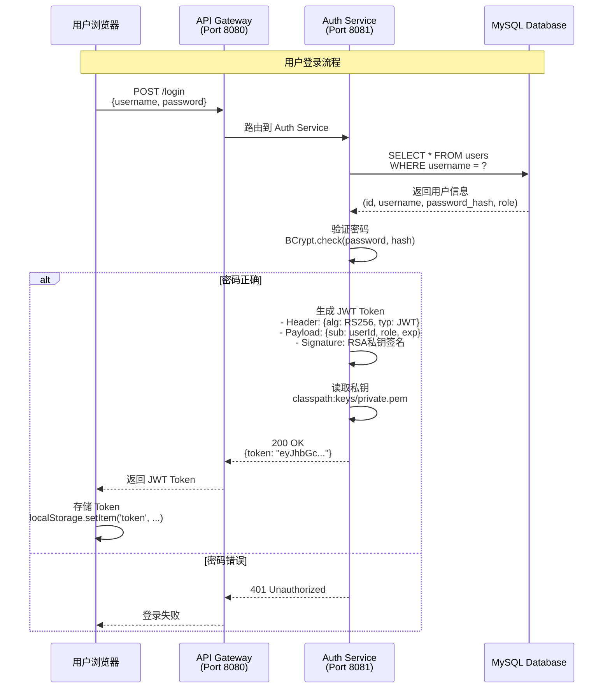
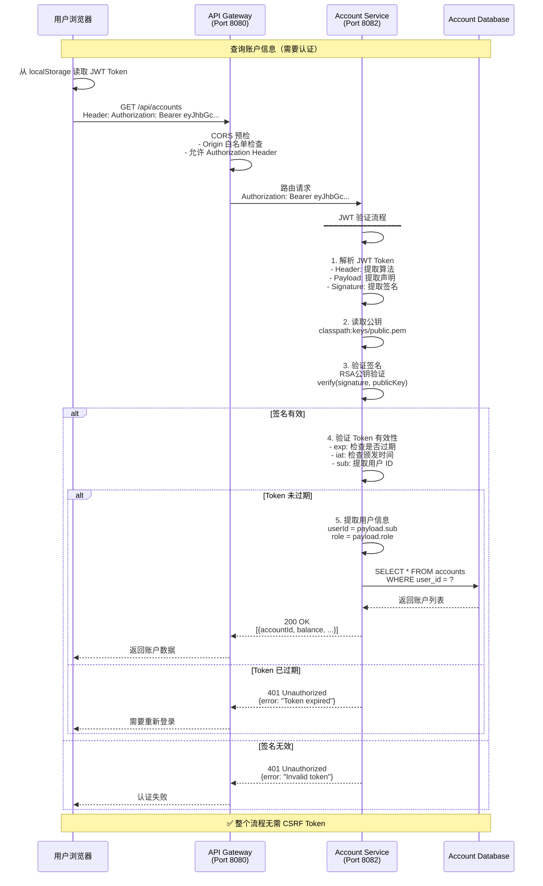
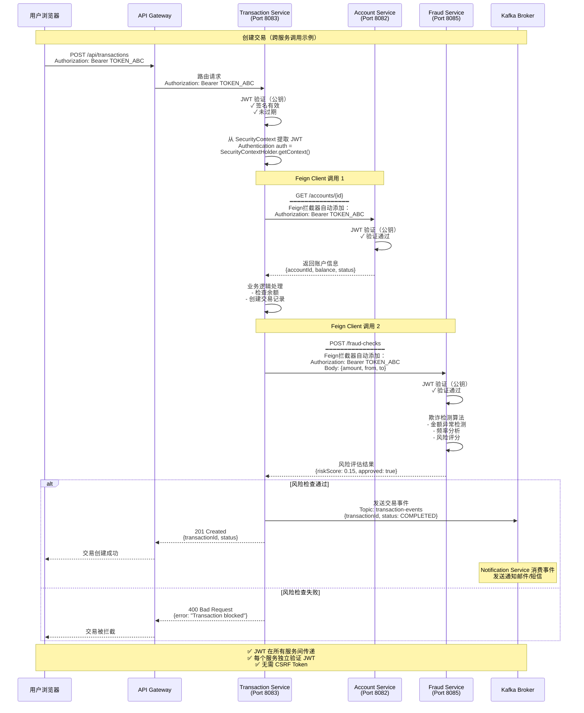

# CSRF 配置与实现分析文档

## 目录
1. [执行摘要](#执行摘要)
2. [CSRF 配置位置](#csrf-配置位置)
3. [实现原理](#实现原理)
4. [时序图](#时序图)
5. [安全架构分析](#安全架构分析)
6. [代码示例](#代码示例)
7. [建议与结论](#建议与结论)

---

## 执行摘要

**关键发现：** FinPay 微服务应用使用 **JWT 无状态认证架构**，在所有服务中 **明确禁用了 CSRF 保护**。

**状态：** ✅ 这是正确的架构决策，适用于 RESTful API 架构

**原因：** JWT 无状态认证本身提供了 CSRF 防护能力，无需传统的 CSRF Token 机制

---

## CSRF 配置位置

### 所有微服务的 CSRF 配置

| 服务名称 | 配置文件路径 | CSRF 状态 | 配置行 |
|---------|-------------|----------|--------|
| **Auth Service** | [auth-service/.../SpringSecurityConfiguration.java](finpay/auth-service/src/main/java/com/finpay/authservice/securities/SpringSecurityConfiguration.java#L84-L85) | 已禁用 | 84-85 |
| **Account Service** | [account-service/.../SecurityConfig.java](finpay/account-service/src/main/java/com/finpay/accounts/securities/SecurityConfig.java#L34) | 已禁用 | 34 |
| **Transaction Service** | [transaction-service/.../SecurityConfig.java](finpay/transaction-service/src/main/java/com/finpay/transactions/securities/SecurityConfig.java#L34) | 已禁用 | 34 |
| **Fraud Service** | [fraud-service/.../SecurityConfig.java](finpay/fraud-service/src/main/java/com/finpay/frauds/securities/SecurityConfig.java#L34) | 已禁用 | 34 |
| **Notification Service** | [notification-service/.../SecurityConfig.java](finpay/notification-service/src/main/java/com/finpay/notifications/securities/SecurityConfig.java#L34) | 已禁用 | 34 |

### 配置代码示例

#### Auth Service（认证服务）

```java
// 文件位置：auth-service/src/main/java/com/finpay/authservice/securities/SpringSecurityConfiguration.java
@Bean
public SecurityFilterChain filterChain(HttpSecurity http) throws Exception {
    // 会话管理：无状态
    http.sessionManagement(
        session -> session.sessionCreationPolicy(SessionCreationPolicy.STATELESS)
    );

    // 禁用 CSRF 保护（无状态 JWT API 不需要）
    http.csrf(AbstractHttpConfigurer::disable);  // 第 84-85 行

    // OAuth2 资源服务器配置（使用 JWT）
    http.oauth2ResourceServer(oauth2 -> oauth2.jwt(withDefaults()));

    // 授权配置
    http.authorizeHttpRequests(auth -> auth
        .requestMatchers("/swagger-ui/**", "/v3/api-docs/**", "/actuator/**").permitAll()
        .requestMatchers(HttpMethod.POST, "/login", "/users").permitAll()
        .anyRequest().authenticated()
    );

    return http.build();
}
```

#### 其他服务的统一配置

```java
// Account/Transaction/Fraud/Notification Services
@Bean
public SecurityFilterChain filterChain(HttpSecurity http) throws Exception {
    http
        // 无状态会话管理
        .sessionManagement(session ->
            session.sessionCreationPolicy(SessionCreationPolicy.STATELESS)
        )
        // 禁用 CSRF（无状态 API）
        .csrf(AbstractHttpConfigurer::disable)  // 第 34 行
        // OAuth2 资源服务器（JWT 验证）
        .oauth2ResourceServer(oauth2 -> oauth2.jwt(withDefaults()))
        // 授权配置
        .authorizeHttpRequests(auth -> auth
            .requestMatchers("/swagger-ui/**", "/v3/api-docs/**", "/actuator/**").permitAll()
            .anyRequest().authenticated()
        );

    return http.build();
}
```

---

## 实现原理

### 1. 传统 CSRF 攻击原理

```
┌─────────────────────────────────────────────────────────────┐
│ 传统基于 Cookie 的会话认证中的 CSRF 攻击                      │
└─────────────────────────────────────────────────────────────┘

1. 用户登录银行网站（bank.com），浏览器存储 Session Cookie
2. 用户访问恶意网站（evil.com）
3. 恶意网站包含隐藏表单：
   <form action="https://bank.com/transfer" method="POST">
     <input name="to" value="attacker">
     <input name="amount" value="10000">
   </form>
   <script>document.forms[0].submit();</script>

4. 浏览器自动携带 Cookie 发送请求到 bank.com
5. 银行服务器验证 Cookie 通过，执行转账
6. 用户资金被盗

攻击成功原因：
- 浏览器自动携带 Cookie
- 服务器仅依赖 Cookie 验证身份
- 没有验证请求来源
```

### 2. 传统 CSRF Token 防护机制

```
┌─────────────────────────────────────────────────────────────┐
│ 传统 CSRF Token 防护流程                                     │
└─────────────────────────────────────────────────────────────┘

服务器                                     浏览器
  │                                          │
  │◄─────── GET /transfer-form ──────────────│
  │                                          │
  │ 生成 CSRF Token: abc123                  │
  │ 存储到 Session                           │
  │                                          │
  │─────── HTML + Token ──────────────────►│
  │  <input type="hidden"                    │
  │   name="csrf_token"                      │
  │   value="abc123">                        │
  │                                          │
  │◄─── POST /transfer ──────────────────────│
  │     Cookie: JSESSIONID=xyz               │
  │     csrf_token=abc123                    │
  │                                          │
  │ 验证：Session Token == 提交的 Token      │
  │ ✓ 匹配 → 执行操作                        │
  │ ✗ 不匹配 → 拒绝请求                      │
  │                                          │
```

### 3. JWT 无状态认证的 CSRF 防护原理

**FinPay 采用的方案：JWT 在 Authorization Header**

```
┌─────────────────────────────────────────────────────────────┐
│ JWT 无状态认证天然防护 CSRF                                  │
└─────────────────────────────────────────────────────────────┘

关键特性：
1. JWT Token 存储在 localStorage/sessionStorage，不是 Cookie
2. Token 必须显式地添加到 Authorization Header
3. 浏览器的同源策略阻止跨域脚本读取 Token
4. CSRF 攻击无法获取并设置 Authorization Header

防护机制：

用户浏览器                      Auth Service                 其他服务
     │                              │                            │
     │──── POST /login ────────────►│                            │
     │     用户名/密码               │                            │
     │                              │                            │
     │                              │ 生成 JWT Token             │
     │                              │ - Header: RS256算法         │
     │                              │ - Payload: 用户信息         │
     │                              │ - Signature: 私钥签名       │
     │                              │                            │
     │◄──── JWT Token ──────────────│                            │
     │                              │                            │
     │ 存储到 localStorage          │                            │
     │                              │                            │
     │──── GET /accounts ──────────────────────────────────────►│
     │     Authorization: Bearer eyJhbGc...                      │
     │                              │                            │
     │                              │                            │ 验证 JWT
     │                              │                            │ - 公钥验证签名
     │                              │                            │ - 检查过期时间
     │                              │                            │ - 提取用户信息
     │                              │                            │
     │◄──── 账户数据 ───────────────────────────────────────────│
     │                              │                            │

恶意网站无法发起 CSRF 攻击：

恶意网站（evil.com）             FinPay API
     │                              │
     │──── POST /transfer ─────────►│
     │     （浏览器发送请求）          │
     │     ❌ 无 Authorization Header │
     │                              │
     │◄──── 401 Unauthorized ───────│
     │                              │

原因：
- JavaScript 无法读取其他域的 localStorage
- 浏览器不会自动添加 Authorization Header
- 同源策略阻止跨域请求携带 Token
```

### 4. 为什么 JWT 可以禁用 CSRF

| 特性 | 基于 Cookie 的会话 | 基于 JWT 的无状态认证 |
|------|-------------------|---------------------|
| **认证信息存储** | 服务器端 Session | 客户端 JWT Token |
| **浏览器存储** | Cookie（自动发送） | localStorage/Header（手动添加） |
| **请求携带方式** | 浏览器自动携带 Cookie | JavaScript 显式设置 Header |
| **跨域自动发送** | ✓ 是 | ✗ 否 |
| **CSRF 风险** | ⚠️ 高（需要 CSRF Token） | ✅ 低（天然防护） |
| **需要 CSRF Token** | ✓ 是 | ✗ 否 |

**JWT 无状态认证防护 CSRF 的核心原因：**

1. **无服务器端会话**
   - 没有 Session 可被劫持
   - 没有 Session Cookie 被自动发送

2. **Token 必须显式添加**
   - JWT 存储在 localStorage/sessionStorage
   - 必须通过 JavaScript 显式添加到 Authorization Header
   - 浏览器不会自动发送

3. **同源策略保护**
   - 恶意网站的 JavaScript 无法读取其他域的 localStorage
   - XMLHttpRequest/Fetch 受同源策略限制
   - 无法获取并设置 Authorization Header

4. **加密签名验证**
   - JWT 使用 RS256 算法签名（私钥签名，公钥验证）
   - 伪造 Token 需要私钥（攻击者无法获取）
   - 每次请求都验证签名的完整性

---

## 时序图

### 时序图 1：用户登录与 JWT 颁发



### 时序图 2：JWT 认证的 API 请求（无 CSRF Token）



### 时序图 3：跨服务调用（Feign Client 传递 JWT）



### 时序图 4：CSRF 攻击失败场景

```mermaid
sequenceDiagram
    participant Attacker as 攻击者网站<br/>(evil.com)
    participant Browser as 受害者浏览器
    participant Gateway as API Gateway<br/>(finpay.com:8080)
    participant Transaction as Transaction Service

    Note over Attacker,Transaction: CSRF 攻击尝试（注定失败）

    Browser->>Browser: 用户已登录 FinPay<br/>JWT 存储在 localStorage

    Browser->>Attacker: 访问恶意网站<br/>http://evil.com

    Attacker-->>Browser: 返回恶意 HTML/JS<br/>━━━━━━━━━━━━━━━━<br/>&lt;script&gt;<br/>fetch('http://finpay.com:8080/api/transactions', {<br/>  method: 'POST',<br/>  body: JSON.stringify({<br/>    from: 'victim-account',<br/>    to: 'attacker-account',<br/>    amount: 10000<br/>  })<br/>})<br/>&lt;/script&gt;

    Browser->>Browser: 执行恶意脚本

    alt 场景1：使用 fetch（无凭证）
        Browser->>Gateway: POST /api/transactions<br/>━━━━━━━━━━━━━━━━<br/>❌ 无 Authorization Header<br/>Origin: http://evil.com

        Gateway->>Gateway: CORS 检查失败<br/>- Origin 不在白名单<br/>- 或缺少 Authorization Header

        Gateway-->>Browser: 403 Forbidden<br/>CORS policy error

        Browser->>Attacker: ❌ 请求被阻止

    else 场景2：尝试读取 localStorage
        Attacker->>Browser: &lt;script&gt;<br/>const token = localStorage.getItem('token')<br/>&lt;/script&gt;

        Browser->>Browser: ❌ 同源策略阻止<br/>SecurityError: <br/>Cannot access localStorage<br/>from different origin

        Browser-->>Attacker: ❌ 无法读取 Token

    else 场景3：使用隐藏表单（传统CSRF）
        Browser->>Gateway: POST /api/transactions<br/>━━━━━━━━━━━━━━━━<br/>Content-Type: application/x-www-form-urlencoded<br/>❌ 无 Authorization Header

        Gateway->>Transaction: 路由请求

        Transaction->>Transaction: JWT 验证失败<br/>- 无 Authorization Header<br/>- 无有效 Token

        Transaction-->>Gateway: 401 Unauthorized<br/>{error: "Missing JWT token"}

        Gateway-->>Browser: 401 Unauthorized

        Browser->>Attacker: ❌ 认证失败
    end

    Note over Attacker,Transaction: ✅ CSRF 攻击无法成功<br/>原因：<br/>1. JWT 不在 Cookie（不会自动发送）<br/>2. 同源策略阻止读取 localStorage<br/>3. Authorization Header 无法伪造<br/>4. CORS 阻止跨域请求
```

### 时序图 5：对比传统 CSRF 防护（如果使用）

```mermaid
sequenceDiagram
    participant User as 用户浏览器
    participant Server as 传统服务器<br/>（基于Session）
    participant DB as 数据库

    Note over User,DB: 传统 CSRF Token 机制（FinPay 未使用）

    User->>Server: GET /transfer-form

    Server->>Server: 生成 CSRF Token<br/>csrfToken = UUID.randomUUID()

    Server->>Server: 存储到 Session<br/>session.put("csrfToken", csrfToken)

    Server-->>User: 200 OK<br/>━━━━━━━━━━━━━━━━<br/>&lt;form&gt;<br/>  &lt;input type="hidden" <br/>    name="_csrf" <br/>    value="abc-123-xyz"&gt;<br/>  &lt;input name="to"&gt;<br/>  &lt;input name="amount"&gt;<br/>&lt;/form&gt;<br/>━━━━━━━━━━━━━━━━<br/>Set-Cookie: JSESSIONID=session123

    User->>User: 用户填写表单

    User->>Server: POST /transfer<br/>━━━━━━━━━━━━━━━━<br/>Cookie: JSESSIONID=session123<br/>_csrf=abc-123-xyz<br/>to=receiver<br/>amount=1000

    Server->>Server: 1. 验证 Session Cookie<br/>session = getSession(JSESSIONID)

    Server->>Server: 2. 验证 CSRF Token<br/>sessionToken = session.get("csrfToken")<br/>requestToken = request.getParam("_csrf")<br/>━━━━━━━━━━━━━━━━<br/>if (sessionToken != requestToken) {<br/>  throw ForbiddenException<br/>}

    alt CSRF Token 匹配
        Server->>DB: 执行转账操作
        DB-->>Server: 成功
        Server-->>User: 200 OK<br/>转账成功

    else CSRF Token 不匹配
        Server-->>User: 403 Forbidden<br/>Invalid CSRF token
    end

    Note over User,DB: FinPay 的 JWT 方案更简洁：<br/>✅ 无需生成 CSRF Token<br/>✅ 无需服务器端 Session<br/>✅ 无需验证 Token 匹配<br/>✅ JWT 签名验证即可
```

---

## 安全架构分析

### 1. JWT 密钥配置

#### 密钥位置

| 服务 | 私钥 | 公钥 | 用途 |
|------|------|------|------|
| Auth Service | `classpath:keys/private.pem` | `classpath:keys/public.pem` | 签发 JWT |
| Account Service | ❌ 无 | `classpath:keys/public.pem` | 验证 JWT |
| Transaction Service | ❌ 无 | `classpath:keys/public.pem` | 验证 JWT |
| Fraud Service | ❌ 无 | `classpath:keys/public.pem` | 验证 JWT |
| Notification Service | ❌ 无 | `classpath:keys/public.pem` | 验证 JWT |

#### 密钥配置代码

```java
// Auth Service - JWT 编码器（签发 Token）
@Bean
public JwtEncoder jwtEncoder() throws Exception {
    // 私钥：用于签名 JWT
    PrivateKey privateKey = loadPrivateKey("classpath:keys/private.pem");
    JWK jwk = new RSAKey.Builder((RSAPublicKey) loadPublicKey("classpath:keys/public.pem"))
            .privateKey(privateKey)
            .build();
    return new NimbusJwtEncoder(new ImmutableJWKSet<>(new JWKSet(jwk)));
}

// 所有服务 - JWT 解码器（验证 Token）
@Bean
public JwtDecoder jwtDecoder() throws Exception {
    // 公钥：用于验证 JWT 签名
    PublicKey publicKey = loadPublicKey("classpath:keys/public.pem");
    return NimbusJwtDecoder.withPublicKey((RSAPublicKey) publicKey).build();
}
```

### 2. CORS 配置（API Gateway）

```yaml
# finpay/api-gateway/src/main/resources/application.yml
spring:
  cloud:
    gateway:
      globalcors:
        cors-configurations:
          '[/**]':
            allowedOrigins:
              - "http://localhost:8080"
              - "http://localhost:5173"  # Vite 开发服务器
              - "http://localhost:5174"  # Vite 备用端口
            allowedMethods:
              - GET
              - POST
              - PUT
              - DELETE
              - OPTIONS
            allowedHeaders: "*"
            allowCredentials: true  # 允许携带凭证（JWT Token）
```

**CORS 与 CSRF 的关系：**
- **CORS**：控制跨域资源共享（哪些域可以访问 API）
- **CSRF**：防止跨站请求伪造（验证请求来源）
- **JWT + CORS** 配合提供双重保护

### 3. 授权策略

#### 公共端点（无需认证）

```java
// 所有服务共有的公共端点
.requestMatchers(
    "/swagger-ui/**",       // Swagger UI 文档
    "/v3/api-docs/**",      // OpenAPI 规范
    "/swagger-ui.html",     // Swagger 首页
    "/actuator/**"          // Spring Boot Actuator 监控
).permitAll()

// Auth Service 特有的公共端点
.requestMatchers(HttpMethod.POST, "/login").permitAll()  // 登录
.requestMatchers(HttpMethod.POST, "/users").permitAll()  // 注册
```

#### 受保护端点（需要认证）

```java
// 其他所有请求都需要认证
.anyRequest().authenticated()
```

### 4. 微服务间调用认证

#### Feign Client 拦截器

```java
// Transaction Service: FeignConfig.java
@Bean
public RequestInterceptor requestInterceptor() {
    return (RequestTemplate template) -> {
        // 从当前请求的 SecurityContext 获取 JWT
        Authentication authentication = SecurityContextHolder
            .getContext()
            .getAuthentication();

        if (authentication != null && authentication.getPrincipal() instanceof Jwt jwt) {
            // 将 JWT 传递到下游服务
            template.header("Authorization", "Bearer " + jwt.getTokenValue());
        }
    };
}
```

**调用流程：**
```
User Request → Transaction Service (JWT: abc123)
                     ↓
              SecurityContext 存储 JWT
                     ↓
              Feign Client 调用 Account Service
                     ↓
              拦截器自动添加: Authorization: Bearer abc123
                     ↓
              Account Service 验证 JWT
```

---

## 代码示例

### 示例 1：用户登录（JWT 颁发）

```java
// Auth Service: AuthController.java
@PostMapping("/login")
public ResponseEntity<LoginResponse> login(@RequestBody LoginRequest request) {
    // 1. 验证用户名密码
    User user = userRepository.findByUsername(request.getUsername())
        .orElseThrow(() -> new BadCredentialsException("Invalid credentials"));

    if (!passwordEncoder.matches(request.getPassword(), user.getPassword())) {
        throw new BadCredentialsException("Invalid credentials");
    }

    // 2. 生成 JWT Token
    Instant now = Instant.now();
    JwtClaimsSet claims = JwtClaimsSet.builder()
        .issuer("auth-service")
        .issuedAt(now)
        .expiresAt(now.plus(1, ChronoUnit.HOURS))  // 1小时过期
        .subject(user.getId().toString())
        .claim("role", user.getRole())
        .claim("username", user.getUsername())
        .build();

    String token = jwtEncoder.encode(JwtEncoderParameters.from(claims)).getTokenValue();

    // 3. 返回 Token（无需 CSRF Token）
    return ResponseEntity.ok(new LoginResponse(token, user.getUsername()));
}
```

### 示例 2：受保护的 API 调用（JWT 验证）

```java
// Account Service: AccountController.java
@GetMapping("/accounts")
public ResponseEntity<List<AccountResponse>> getAccounts() {
    // 1. Spring Security 自动验证 JWT（在请求到达这里之前）
    //    - SecurityFilterChain 中的 oauth2ResourceServer 配置
    //    - JwtDecoder 使用公钥验证签名
    //    - 验证失败 → 自动返回 401

    // 2. 从 SecurityContext 获取已验证的用户信息
    Authentication authentication = SecurityContextHolder.getContext().getAuthentication();
    Jwt jwt = (Jwt) authentication.getPrincipal();
    Long userId = Long.parseLong(jwt.getSubject());

    // 3. 执行业务逻辑
    List<Account> accounts = accountService.getAccountsByUserId(userId);

    // 4. 返回数据（无需返回 CSRF Token）
    return ResponseEntity.ok(accounts.stream()
        .map(AccountResponse::from)
        .collect(Collectors.toList()));
}
```

### 示例 3：前端调用（显式添加 JWT）

```javascript
// 前端代码示例（React/Vue）

// 登录
async function login(username, password) {
  const response = await fetch('http://localhost:8080/login', {
    method: 'POST',
    headers: {
      'Content-Type': 'application/json'
    },
    body: JSON.stringify({ username, password })
  });

  const data = await response.json();

  // 存储 JWT Token 到 localStorage
  localStorage.setItem('token', data.token);
}

// 调用受保护的 API
async function getAccounts() {
  // 从 localStorage 读取 Token
  const token = localStorage.getItem('token');

  // 显式添加到 Authorization Header（关键！）
  const response = await fetch('http://localhost:8080/api/accounts', {
    method: 'GET',
    headers: {
      'Authorization': `Bearer ${token}`,  // 必须手动添加
      'Content-Type': 'application/json'
    }
  });

  if (response.status === 401) {
    // Token 过期或无效，跳转到登录页
    localStorage.removeItem('token');
    window.location.href = '/login';
    return;
  }

  return await response.json();
}

// CSRF 攻击无法成功的原因：
// 1. 恶意网站无法读取 localStorage.getItem('token')（同源策略）
// 2. 浏览器不会自动添加 Authorization Header
// 3. 没有 Token → 请求被 401 拒绝
```

### 示例 4：如果启用 CSRF（对比示例）

```java
// 假设要启用 CSRF（FinPay 未使用）
@Bean
public SecurityFilterChain filterChain(HttpSecurity http) throws Exception {
    http
        .csrf(csrf -> csrf
            .csrfTokenRepository(CookieCsrfTokenRepository.withHttpOnlyFalse())
            .csrfTokenRequestHandler(new CsrfTokenRequestAttributeHandler())
        )
        .authorizeHttpRequests(auth -> auth
            .anyRequest().authenticated()
        );
    return http.build();
}

// 前端需要处理 CSRF Token
async function createTransaction(data) {
    // 1. 先获取 CSRF Token
    const csrfResponse = await fetch('/csrf-token');
    const csrfData = await csrfResponse.json();

    // 2. 发送请求时同时携带 JWT 和 CSRF Token
    const response = await fetch('/api/transactions', {
        method: 'POST',
        headers: {
            'Authorization': `Bearer ${localStorage.getItem('token')}`,
            'X-CSRF-TOKEN': csrfData.token  // 需要额外的 CSRF Token
        },
        body: JSON.stringify(data)
    });
}

// FinPay 的 JWT 方案更简洁：无需上述额外步骤
```

---

## 建议与结论

### ✅ 当前架构的优势

1. **简化开发**
   - 无需管理 CSRF Token 生命周期
   - 无需在表单中嵌入隐藏的 Token 字段
   - 前端代码更简洁

2. **提升性能**
   - 无状态架构，服务器不存储 Session
   - 更好的水平扩展能力
   - 减少服务器内存占用

3. **增强安全性**
   - JWT 加密签名防伪造
   - Token 过期机制
   - 无 Session 劫持风险

4. **微服务友好**
   - Token 可在服务间传递
   - 每个服务独立验证
   - 无需共享 Session 存储

### ⚠️ 需要注意的安全要点

1. **JWT 密钥管理**
   - ❌ 当前：密钥文件存储在代码仓库中
   - ✅ 建议：使用密钥管理服务（AWS KMS, HashiCorp Vault）
   - ✅ 建议：定期轮换密钥

2. **Token 过期策略**
   - 当前：1小时过期（需确认）
   - 建议：短过期时间（15-30分钟）+ Refresh Token 机制

3. **Token 存储安全**
   - ⚠️ localStorage 存在 XSS 风险
   - 建议：考虑使用 HttpOnly Cookie 存储 Refresh Token
   - 建议：实施严格的 CSP（Content Security Policy）

4. **Token 撤销机制**
   - ❌ 当前：JWT 无法在过期前撤销
   - ✅ 建议：实施 Token 黑名单（Redis）
   - ✅ 建议：或使用短期 JWT + 长期 Refresh Token

### 📋 安全检查清单

- [x] CSRF 保护正确禁用（JWT 无状态架构）
- [x] JWT 签名验证已实施（所有服务）
- [x] CORS 已正确配置（API Gateway）
- [x] 公共/私有端点正确区分
- [x] Feign Client 正确传递 JWT
- [ ] JWT 密钥安全存储（需改进）
- [ ] Token 刷新机制（待实施）
- [ ] Token 撤销机制（待实施）
- [ ] XSS 防护（CSP 策略）
- [ ] Rate Limiting（部分实施）

### 🎯 结论

**FinPay 的 CSRF 配置是正确的：**

1. ✅ **架构选择正确**：JWT 无状态认证适合微服务 RESTful API
2. ✅ **实施一致**：所有服务统一禁用 CSRF
3. ✅ **文档清晰**：代码注释说明了禁用原因
4. ✅ **安全等效**：JWT 提供了等效的 CSRF 防护

**这是现代微服务架构的最佳实践，而非安全漏洞。**

---

## 附录

### A. 相关文件清单

1. **安全配置文件**
   - [auth-service/.../SpringSecurityConfiguration.java](finpay/auth-service/src/main/java/com/finpay/authservice/securities/SpringSecurityConfiguration.java)
   - [account-service/.../SecurityConfig.java](finpay/account-service/src/main/java/com/finpay/accounts/securities/SecurityConfig.java)
   - [transaction-service/.../SecurityConfig.java](finpay/transaction-service/src/main/java/com/finpay/transactions/securities/SecurityConfig.java)
   - [fraud-service/.../SecurityConfig.java](finpay/fraud-service/src/main/java/com/finpay/frauds/securities/SecurityConfig.java)
   - [notification-service/.../SecurityConfig.java](finpay/notification-service/src/main/java/com/finpay/notifications/securities/SecurityConfig.java)

2. **Feign 配置文件**
   - [transaction-service/.../FeignConfig.java](finpay/transaction-service/src/main/java/com/finpay/transactions/configs/FeignConfig.java)

3. **API Gateway 配置**
   - [api-gateway/src/main/resources/application.yml](finpay/api-gateway/src/main/resources/application.yml)

4. **JWT 密钥位置**
   - `auth-service/src/main/resources/keys/private.pem`
   - `auth-service/src/main/resources/keys/public.pem`
   - `*/src/main/resources/keys/public.pem`（其他服务）

### B. 参考资料

- [OWASP CSRF Prevention Cheat Sheet](https://cheatsheetseries.owasp.org/cheatsheets/Cross-Site_Request_Forgery_Prevention_Cheat_Sheet.html)
- [RFC 7519 - JSON Web Token (JWT)](https://datatracker.ietf.org/doc/html/rfc7519)
- [Spring Security - CSRF Protection](https://docs.spring.io/spring-security/reference/features/exploits/csrf.html)
- [Spring Security - OAuth2 Resource Server](https://docs.spring.io/spring-security/reference/servlet/oauth2/resource-server/index.html)

### C. 术语表

| 术语 | 全称 | 说明 |
|------|------|------|
| CSRF | Cross-Site Request Forgery | 跨站请求伪造攻击 |
| JWT | JSON Web Token | JSON Web 令牌 |
| CORS | Cross-Origin Resource Sharing | 跨域资源共享 |
| XSS | Cross-Site Scripting | 跨站脚本攻击 |
| RS256 | RSA Signature with SHA-256 | RSA 签名算法 |
| STATELESS | Stateless Session | 无状态会话管理 |
| CSP | Content Security Policy | 内容安全策略 |

---

**文档版本：** 1.0
**生成时间：** 2025-10-25
**分析工具：** Claude Code
**分析范围：** FinPay 微服务项目完整代码库
