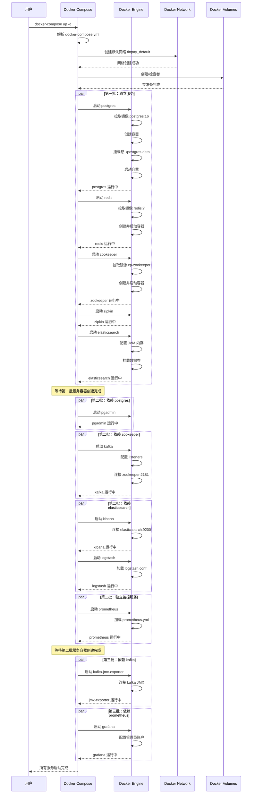
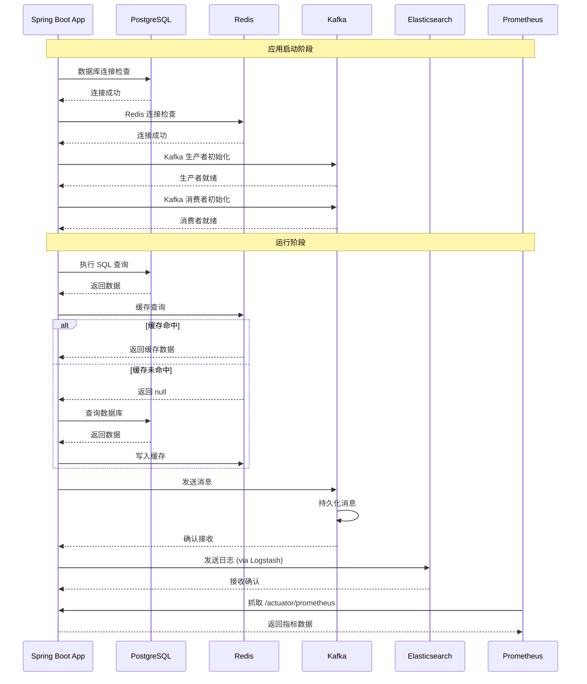

# Docker 配置实践指南

## 目录
1. [Docker 基础原理](#docker-基础原理)
2. [Docker Compose 架构](#docker-compose-架构)
3. [FinPay 项目 Docker 配置详解](#finpay-项目-docker-配置详解)
4. [服务启动时序图](#服务启动时序图)
5. [网络通信原理](#网络通信原理)
6. [数据持久化实践](#数据持久化实践)
7. [最佳实践与优化](#最佳实践与优化)
8. [常见问题与解决方案](#常见问题与解决方案)

---

## Docker 基础原理

### 1.1 Docker 核心概念

#### 容器 vs 虚拟机
```
虚拟机架构:
┌─────────────────────────────────────┐
│         Application A               │
│         Application B               │
├─────────────────────────────────────┤
│       Guest OS A  │  Guest OS B     │
├─────────────────────────────────────┤
│           Hypervisor                │
├─────────────────────────────────────┤
│           Host OS                   │
├─────────────────────────────────────┤
│        Physical Hardware            │
└─────────────────────────────────────┘

Docker 容器架构:
┌─────────────────────────────────────┐
│    Container A  │  Container B      │
│   (App + Libs)  │  (App + Libs)     │
├─────────────────────────────────────┤
│         Docker Engine               │
├─────────────────────────────────────┤
│           Host OS                   │
├─────────────────────────────────────┤
│        Physical Hardware            │
└─────────────────────────────────────┘
```

**核心优势:**
- **轻量级**: 容器共享宿主机内核，无需完整 OS
- **快速启动**: 秒级启动，而非虚拟机的分钟级
- **资源隔离**: 使用 Linux Namespaces 和 Cgroups
- **可移植性**: "Build once, run anywhere"

### 1.2 Docker 核心组件

```
┌──────────────────────────────────────────────────────┐
│                   Docker Client                      │
│              (docker CLI commands)                   │
└────────────────────┬─────────────────────────────────┘
                     │ REST API
┌────────────────────▼─────────────────────────────────┐
│                Docker Daemon (dockerd)               │
│  ┌──────────────────────────────────────────────┐   │
│  │         Container Management                  │   │
│  ├──────────────────────────────────────────────┤   │
│  │          Image Management                     │   │
│  ├──────────────────────────────────────────────┤   │
│  │         Network Management                    │   │
│  ├──────────────────────────────────────────────┤   │
│  │         Volume Management                     │   │
│  └──────────────────────────────────────────────┘   │
└──────────────────────────────────────────────────────┘
         │              │              │
         ▼              ▼              ▼
   ┌─────────┐    ┌─────────┐    ┌─────────┐
   │Container│    │Container│    │Container│
   │    A    │    │    B    │    │    C    │
   └─────────┘    └─────────┘    └─────────┘
```

### 1.3 关键技术

#### Namespaces (命名空间)
```
进程隔离:
┌──────────────────────────────────────┐
│  Container 1        Container 2      │
│  ┌──────────┐      ┌──────────┐     │
│  │ PID: 1   │      │ PID: 1   │     │
│  │ PID: 2   │      │ PID: 2   │     │
│  └──────────┘      └──────────┘     │
├──────────────────────────────────────┤
│         Host OS (真实 PID)           │
│    Container 1: PID 1234, 1235      │
│    Container 2: PID 1236, 1237      │
└──────────────────────────────────────┘
```

**Namespace 类型:**
- **PID**: 进程隔离
- **NET**: 网络隔离
- **IPC**: 进程间通信隔离
- **MNT**: 文件系统挂载点隔离
- **UTS**: 主机名隔离
- **User**: 用户和用户组隔离

#### Cgroups (控制组)
```
资源限制示例:
Container A:
  - CPU: 2 cores (50%)
  - Memory: 2GB
  - Disk I/O: 100MB/s

Container B:
  - CPU: 1 core (25%)
  - Memory: 1GB
  - Disk I/O: 50MB/s
```

---

## Docker Compose 架构

### 2.1 Docker Compose 工作原理

```
docker-compose.yml
       │
       ├─ 定义服务(services)
       ├─ 定义网络(networks)
       ├─ 定义卷(volumes)
       │
       ▼
Docker Compose CLI
       │
       ├─ 解析 YAML 文件
       ├─ 验证配置
       ├─ 创建执行计划
       │
       ▼
Docker Engine API
       │
       ├─ 创建网络
       ├─ 创建卷
       ├─ 拉取镜像
       ├─ 创建并启动容器
       │
       ▼
   运行中的容器栈
```

### 2.2 服务依赖管理

```yaml
# 依赖关系示例
services:
  app:
    depends_on:
      - database
      - cache

  database:
    # 无依赖，优先启动

  cache:
    # 无依赖，优先启动
```

**启动顺序:**
```
第一批: database, cache (并行启动)
   │
   ├─ 等待容器创建完成
   ▼
第二批: app (在依赖项之后启动)
```

**注意:** `depends_on` 只等待容器启动，不等待服务就绪！

---

## FinPay 项目 Docker 配置详解

### 3.1 架构概览

```
┌─────────────────────────────────────────────────────────────┐
│                      FinPay 微服务架构                       │
├─────────────────────────────────────────────────────────────┤
│  基础设施层 (Infrastructure Layer)                          │
│  ┌────────┐ ┌────────┐ ┌──────────┐ ┌──────────┐          │
│  │Postgres│ │ Redis  │ │Zookeeper │ │  Zipkin  │          │
│  │  :5432 │ │ :6379  │ │  :2181   │ │  :9411   │          │
│  └────────┘ └────────┘ └──────────┘ └──────────┘          │
├─────────────────────────────────────────────────────────────┤
│  消息队列层 (Message Queue Layer)                           │
│  ┌────────────────────────────────────────┐                │
│  │         Kafka Cluster                  │                │
│  │  ┌────────┐  ┌──────────────┐         │                │
│  │  │ Kafka  │  │ JMX Exporter │         │                │
│  │  │ :9092  │  │    :7071     │         │                │
│  │  └────────┘  └──────────────┘         │                │
│  └────────────────────────────────────────┘                │
├─────────────────────────────────────────────────────────────┤
│  监控日志层 (Monitoring & Logging Layer)                    │
│  ┌────────────┐ ┌─────────┐ ┌──────────────┐              │
│  │Elasticsearch│ │ Logstash│ │    Kibana    │              │
│  │   :9200    │ │  :5001  │ │    :5601     │              │
│  └────────────┘ └─────────┘ └──────────────┘              │
│  ┌────────────┐ ┌─────────┐                                │
│  │ Prometheus │ │ Grafana │                                │
│  │   :9090    │ │  :3000  │                                │
│  └────────────┘ └─────────┘                                │
├─────────────────────────────────────────────────────────────┤
│  管理工具层 (Management Tools Layer)                        │
│  ┌────────────┐                                             │
│  │  PgAdmin   │                                             │
│  │   :5050    │                                             │
│  └────────────┘                                             │
└─────────────────────────────────────────────────────────────┘
```

### 3.2 服务配置详解

#### 3.2.1 PostgreSQL 数据库

```yaml
postgres:
  image: postgres:16
  environment:
    POSTGRES_DB: finpay
    POSTGRES_USER: finpay
    POSTGRES_PASSWORD: finpay
  ports:
    - "5432:5432"
  volumes:
    - ./postgres-data:/var/lib/postgresql/data
```

**配置解析:**
- **镜像版本**: PostgreSQL 16 (最新稳定版)
- **数据库初始化**: 自动创建 `finpay` 数据库
- **端口映射**: `宿主机:5432 → 容器:5432`
- **数据持久化**: 本地目录映射到容器数据目录

**数据持久化原理:**
```
宿主机文件系统                容器文件系统
┌─────────────────┐          ┌──────────────────────┐
│ ./postgres-data │  ←───→   │ /var/lib/postgresql/ │
│   ├─ base/      │          │        data/         │
│   ├─ global/    │          │   ├─ base/           │
│   ├─ pg_wal/    │          │   ├─ global/         │
│   └─ ...        │          │   └─ ...             │
└─────────────────┘          └──────────────────────┘
```

#### 3.2.2 PgAdmin 管理工具

```yaml
pgadmin:
  image: dpage/pgadmin4:latest
  environment:
    - PGADMIN_DEFAULT_EMAIL=admin@example.com
    - PGADMIN_DEFAULT_PASSWORD=finpay
    - PGADMIN_CONFIG_SERVER_MODE=False
  ports:
    - "5050:80"
  depends_on:
    - postgres
```

**访问方式:**
1. 打开浏览器: `http://localhost:5050`
2. 登录: `admin@example.com` / `finpay`
3. 添加服务器:
   - Host: `postgres` (Docker 网络内部主机名)
   - Port: `5432`
   - Username: `finpay`
   - Password: `finpay`

#### 3.2.3 Redis 缓存

```yaml
redis:
  image: redis:7
  ports:
    - "6379:6379"
```

**简洁配置说明:**
- 无需持久化配置(可选)
- 使用默认配置
- 适用于缓存场景

**Redis 持久化选项(可添加):**
```yaml
redis:
  image: redis:7
  command: redis-server --appendonly yes
  volumes:
    - ./redis-data:/data
  ports:
    - "6379:6379"
```

#### 3.2.4 Kafka 消息队列集群

```yaml
zookeeper:
  image: confluentinc/cp-zookeeper:7.6.0
  environment:
    ZOOKEEPER_CLIENT_PORT: 2181
    ZOOKEEPER_TICK_TIME: 2000
  ports:
    - "2181:2181"

kafka:
  image: confluentinc/cp-kafka:7.6.0
  hostname: kafka
  environment:
    KAFKA_BROKER_ID: 1
    KAFKA_ZOOKEEPER_CONNECT: zookeeper:2181
    KAFKA_LISTENERS: INTERNAL://0.0.0.0:29092,EXTERNAL://0.0.0.0:9092
    KAFKA_ADVERTISED_LISTENERS: INTERNAL://kafka:29092,EXTERNAL://localhost:9092
    KAFKA_LISTENER_SECURITY_PROTOCOL_MAP: INTERNAL:PLAINTEXT,EXTERNAL:PLAINTEXT
    KAFKA_INTER_BROKER_LISTENER_NAME: INTERNAL
    KAFKA_JMX_PORT: 9999
  ports:
    - "9092:9092"
    - "9999:9999"
  depends_on:
    - zookeeper
```

**Kafka 监听器配置详解:**

```
┌─────────────────────────────────────────────────────────┐
│                    Kafka Listeners                      │
├─────────────────────────────────────────────────────────┤
│  INTERNAL (容器间通信)                                  │
│  ┌───────────────────────────────────────┐             │
│  │  kafka:29092                          │             │
│  │  ↑                                    │             │
│  │  └─ Spring Boot 应用通过内部网络访问   │             │
│  └───────────────────────────────────────┘             │
│                                                         │
│  EXTERNAL (宿主机访问)                                  │
│  ┌───────────────────────────────────────┐             │
│  │  localhost:9092                       │             │
│  │  ↑                                    │             │
│  │  └─ 开发工具、测试脚本通过宿主机访问    │             │
│  └───────────────────────────────────────┘             │
└─────────────────────────────────────────────────────────┘
```

#### 3.2.5 ELK 日志栈

**Elasticsearch:**
```yaml
elasticsearch:
  image: docker.elastic.co/elasticsearch/elasticsearch:8.10.2
  environment:
    - discovery.type=single-node
    - xpack.security.enabled=false
    - ES_JAVA_OPTS=-Xms512m -Xmx512m
  ports:
    - "9200:9200"
    - "9300:9300"
  volumes:
    - ./elasticsearch-data:/usr/share/elasticsearch/data
```

**内存配置说明:**
- `-Xms512m`: 初始堆内存 512MB
- `-Xmx512m`: 最大堆内存 512MB
- 固定大小避免 GC 性能问题

**Kibana:**
```yaml
kibana:
  image: docker.elastic.co/kibana/kibana:8.10.2
  environment:
    - ELASTICSEARCH_HOSTS=http://elasticsearch:9200
  ports:
    - "5601:5601"
  depends_on:
    - elasticsearch
```

**Logstash:**
```yaml
logstash:
  image: docker.elastic.co/logstash/logstash:8.10.2
  ports:
    - "5001:5000"
  volumes:
    - ./logstash.conf:/usr/share/logstash/pipeline/logstash.conf
  depends_on:
    - elasticsearch
```

**日志处理流程:**
```
Spring Boot 应用
    │ (Logback TCP)
    ▼
Logstash :5001
    │ (解析、过滤、转换)
    ▼
Elasticsearch :9200
    │ (索引、存储)
    ▼
Kibana :5601
    │ (可视化查询)
    ▼
用户浏览器
```

#### 3.2.6 监控栈 (Prometheus + Grafana)

```yaml
prometheus:
  image: prom/prometheus:latest
  volumes:
    - ./prometheus.yml:/etc/prometheus/prometheus.yml
  ports:
    - "9090:9090"

grafana:
  image: grafana/grafana:latest
  ports:
    - "3000:3000"
  environment:
    - GF_SECURITY_ADMIN_USER=admin
    - GF_SECURITY_ADMIN_PASSWORD=admin
  depends_on:
    - prometheus
```

**监控数据流:**
```
Spring Boot 应用          Kafka
    │ (Micrometer)          │ (JMX)
    ▼                       ▼
Actuator Endpoint    JMX Exporter :7071
    │                       │
    └───────┬───────────────┘
            ▼
    Prometheus :9090 (抓取指标)
            │
            ├─ 时序数据存储
            ├─ PromQL 查询
            │
            ▼
     Grafana :3000 (可视化)
            │
            └─ 仪表板展示
```

---

## 服务启动时序图

### 4.1 完整启动流程



### 4.2 服务间通信时序



### 4.3 健康检查流程

```
┌──────────────────────────────────────────────────────┐
│              容器健康检查机制                         │
├──────────────────────────────────────────────────────┤
│                                                      │
│  Docker Engine                                       │
│       │                                              │
│       ├─ 每 30 秒执行健康检查命令                     │
│       │                                              │
│       ├─ PostgreSQL:                                 │
│       │   pg_isready -U finpay                       │
│       │                                              │
│       ├─ Redis:                                      │
│       │   redis-cli ping                             │
│       │                                              │
│       ├─ Kafka:                                      │
│       │   kafka-broker-api-versions --bootstrap...   │
│       │                                              │
│       ├─ Elasticsearch:                              │
│       │   curl -f http://localhost:9200/_cluster/... │
│       │                                              │
│       └─ 健康状态:                                   │
│           - starting (启动中)                        │
│           - healthy (健康)                           │
│           - unhealthy (不健康)                       │
│                                                      │
└──────────────────────────────────────────────────────┘
```

---

## 网络通信原理

### 5.1 Docker 网络模式

```
┌─────────────────────────────────────────────────────┐
│            Docker 网络模式对比                       │
├─────────────┬───────────────────────────────────────┤
│ bridge      │ 默认模式，容器间通过虚拟网桥通信      │
│ (默认)      │ ✓ 容器间隔离                          │
│             │ ✓ 通过容器名通信                      │
├─────────────┼───────────────────────────────────────┤
│ host        │ 容器使用宿主机网络栈                  │
│             │ ✓ 性能最佳                            │
│             │ ✗ 失去网络隔离                        │
├─────────────┼───────────────────────────────────────┤
│ none        │ 无网络配置                            │
│             │ ✓ 完全隔离                            │
├─────────────┼───────────────────────────────────────┤
│ overlay     │ 跨主机通信(Swarm/Kubernetes)          │
│             │ ✓ 多主机集群                          │
└─────────────┴───────────────────────────────────────┘
```

### 5.2 FinPay 默认网络架构

```
宿主机 (Host OS)
└─ Docker0 网桥: 172.17.0.1
   │
   ├─ finpay_default 网络: 172.18.0.0/16
   │  │
   │  ├─ postgres:      172.18.0.2
   │  ├─ redis:         172.18.0.3
   │  ├─ zookeeper:     172.18.0.4
   │  ├─ kafka:         172.18.0.5
   │  ├─ elasticsearch: 172.18.0.6
   │  ├─ prometheus:    172.18.0.7
   │  ├─ grafana:       172.18.0.8
   │  ├─ ...
   │  │
   │  └─ 内置 DNS 服务器
   │     ├─ postgres     → 172.18.0.2
   │     ├─ redis        → 172.18.0.3
   │     ├─ kafka        → 172.18.0.5
   │     └─ ...
   │
   └─ 端口映射到宿主机
      ├─ 5432 → postgres:5432
      ├─ 6379 → redis:6379
      ├─ 9092 → kafka:9092
      └─ ...
```

### 5.3 DNS 解析机制

```
容器内应用查询 "postgres"
        │
        ▼
容器内 DNS 客户端 (/etc/resolv.conf)
        │
        ├─ nameserver 127.0.0.11 (Docker 内置 DNS)
        │
        ▼
Docker 内置 DNS 服务器
        │
        ├─ 查询网络内容器名
        ├─ 查找容器别名
        │
        ▼
返回 IP: 172.18.0.2
        │
        ▼
建立 TCP 连接
```

**示例配置:**
```properties
# Spring Boot application.yml
spring:
  datasource:
    url: jdbc:postgresql://postgres:5432/finpay  # 使用容器名
    # 而非 jdbc:postgresql://172.18.0.2:5432/finpay

  kafka:
    bootstrap-servers: kafka:29092  # 内部监听器
    # 而非 localhost:9092
```

### 5.4 端口映射原理

```
┌──────────────────────────────────────────────────────┐
│                 端口映射 (Port Mapping)               │
├──────────────────────────────────────────────────────┤
│                                                      │
│  宿主机                                              │
│  ┌────────────────────────────────────────┐         │
│  │  监听端口: 0.0.0.0:5432                │         │
│  │       │                                │         │
│  │       ├─ iptables NAT 规则             │         │
│  │       │  DNAT 转发                     │         │
│  │       │                                │         │
│  │       ▼                                │         │
│  │  Docker Proxy                          │         │
│  └───────┬────────────────────────────────┘         │
│          │                                           │
│          ├─ 转发到容器网络                           │
│          │                                           │
│          ▼                                           │
│  ┌────────────────────────────────────────┐         │
│  │  容器: postgres                        │         │
│  │  IP: 172.18.0.2                        │         │
│  │  监听端口: 5432                        │         │
│  └────────────────────────────────────────┘         │
│                                                      │
└──────────────────────────────────────────────────────┘
```

**iptables 规则示例:**
```bash
# 查看 Docker 创建的 NAT 规则
sudo iptables -t nat -L -n | grep 5432

# 输出示例:
DNAT  tcp  --  0.0.0.0/0  0.0.0.0/0  tcp dpt:5432 to:172.18.0.2:5432
```

---

## 数据持久化实践

### 6.1 卷类型对比

```
┌──────────────────────────────────────────────────────────┐
│              Docker 卷类型                                │
├──────────────┬───────────────────────────────────────────┤
│ Named Volume │ Docker 管理的卷                           │
│              │ 位置: /var/lib/docker/volumes/            │
│              │ ✓ Docker 完全管理                         │
│              │ ✓ 跨平台兼容性好                          │
│              │ ✗ 不易直接访问                            │
├──────────────┼───────────────────────────────────────────┤
│ Bind Mount   │ 宿主机目录映射                            │
│              │ 位置: 项目目录下                          │
│              │ ✓ 易于访问和备份                          │
│              │ ✓ 开发环境友好                            │
│              │ ✗ 路径依赖性强                            │
├──────────────┼───────────────────────────────────────────┤
│ tmpfs Mount  │ 内存文件系统                              │
│              │ 位置: 宿主机内存                          │
│              │ ✓ 高性能                                  │
│              │ ✗ 容器停止数据丢失                        │
└──────────────┴───────────────────────────────────────────┘
```

### 6.2 FinPay 持久化策略

#### PostgreSQL 数据持久化

```yaml
volumes:
  - ./postgres-data:/var/lib/postgresql/data
```

**目录结构:**
```
postgres-data/
├── base/              # 数据库文件
│   ├── 1/            # template1
│   ├── 4/            # template0
│   └── 16384/        # finpay 数据库
├── global/            # 全局表
├── pg_wal/            # WAL 日志
│   ├── 000000010000000000000001
│   └── ...
├── pg_stat/           # 统计信息
├── pg_tblspc/         # 表空间
└── postgresql.conf    # 配置文件
```

**数据完整性保证:**
```
写入事务
    │
    ├─ 1. 写入 WAL 日志 (pg_wal/)
    │     │
    │     └─ fsync 强制刷盘
    │
    ├─ 2. 修改内存缓冲区
    │
    └─ 3. 后台进程定期刷盘到数据文件 (base/)
```

#### Elasticsearch 数据持久化

```yaml
volumes:
  - ./elasticsearch-data:/usr/share/elasticsearch/data
```

**索引数据结构:**
```
elasticsearch-data/
└── nodes/
    └── 0/
        ├── indices/
        │   └── <index-uuid>/
        │       ├── 0/          # Shard 0
        │       │   ├── index/
        │       │   └── translog/
        │       └── _state/
        ├── _state/
        └── node.lock
```

### 6.3 备份策略

#### 数据库备份脚本

```bash
#!/bin/bash
# backup-postgres.sh

BACKUP_DIR="./backups/postgres"
TIMESTAMP=$(date +%Y%m%d_%H%M%S)
BACKUP_FILE="$BACKUP_DIR/finpay_$TIMESTAMP.sql"

mkdir -p $BACKUP_DIR

docker exec postgres pg_dump -U finpay finpay > $BACKUP_FILE

# 压缩备份
gzip $BACKUP_FILE

# 删除 7 天前的备份
find $BACKUP_DIR -name "*.sql.gz" -mtime +7 -delete

echo "Backup completed: ${BACKUP_FILE}.gz"
```

#### 数据恢复

```bash
# 恢复 PostgreSQL
gunzip -c backups/postgres/finpay_20250101_120000.sql.gz | \
  docker exec -i postgres psql -U finpay finpay

# 恢复 Elasticsearch (快照方式)
curl -X POST "localhost:9200/_snapshot/my_backup/snapshot_1/_restore"
```

---

## 最佳实践与优化

### 7.1 资源限制配置

```yaml
services:
  postgres:
    image: postgres:16
    deploy:
      resources:
        limits:
          cpus: '2.0'
          memory: 2G
        reservations:
          cpus: '1.0'
          memory: 1G
    # ...
```

**资源配置建议:**
```
┌──────────────┬──────────┬──────────┬──────────────┐
│ 服务         │ CPU限制  │ 内存限制 │ 理由         │
├──────────────┼──────────┼──────────┼──────────────┤
│ PostgreSQL   │ 2 cores  │ 2GB      │ 数据库操作   │
│ Redis        │ 0.5 core │ 512MB    │ 内存缓存     │
│ Kafka        │ 2 cores  │ 2GB      │ 消息处理     │
│ Elasticsearch│ 2 cores  │ 2GB      │ 索引搜索     │
│ Prometheus   │ 1 core   │ 1GB      │ 时序数据     │
│ Grafana      │ 0.5 core │ 512MB    │ Web 界面     │
└──────────────┴──────────┴──────────┴──────────────┘
```

### 7.2 环境变量管理

```yaml
# 不推荐：硬编码密码
environment:
  POSTGRES_PASSWORD: finpay

# 推荐：使用环境变量文件
env_file:
  - .env

# 生产环境：使用 Docker Secrets
secrets:
  - db_password

environment:
  POSTGRES_PASSWORD_FILE: /run/secrets/db_password
```

**.env 文件示例:**
```bash
# Database
POSTGRES_DB=finpay
POSTGRES_USER=finpay
POSTGRES_PASSWORD=${DB_PASSWORD:-finpay}

# Redis
REDIS_PASSWORD=${REDIS_PASSWORD:-}

# Kafka
KAFKA_BROKER_ID=1

# Monitoring
GRAFANA_ADMIN_PASSWORD=${GRAFANA_PASSWORD:-admin}
```

### 7.3 日志管理

```yaml
services:
  postgres:
    logging:
      driver: "json-file"
      options:
        max-size: "10m"
        max-file: "3"
```

**日志驱动对比:**
```
┌─────────────┬────────────────────────────────────┐
│ json-file   │ 默认，JSON 格式，支持 docker logs  │
│ syslog      │ 系统日志，集中管理                 │
│ journald    │ systemd 日志                       │
│ gelf        │ Graylog 扩展日志格式               │
│ fluentd     │ Fluentd 日志聚合                   │
└─────────────┴────────────────────────────────────┘
```

### 7.4 健康检查配置

```yaml
services:
  postgres:
    healthcheck:
      test: ["CMD-SHELL", "pg_isready -U finpay"]
      interval: 30s
      timeout: 10s
      retries: 3
      start_period: 40s

  kafka:
    healthcheck:
      test: ["CMD", "kafka-broker-api-versions", "--bootstrap-server", "localhost:9092"]
      interval: 30s
      timeout: 10s
      retries: 5
      start_period: 60s
```

**健康检查状态机:**
```
starting (启动期)
    │ start_period 内失败不计入 retries
    ▼
healthy (健康)
    │ 检查失败
    ▼
unhealthy (不健康)
    │ 连续失败 >= retries
    ▼
容器重启 (如果配置了 restart policy)
```

### 7.5 网络隔离

```yaml
networks:
  frontend:
    driver: bridge
  backend:
    driver: bridge
  monitoring:
    driver: bridge

services:
  api-gateway:
    networks:
      - frontend
      - backend

  postgres:
    networks:
      - backend  # 只在后端网络，前端无法直接访问

  prometheus:
    networks:
      - monitoring
      - backend  # 可访问后端服务收集指标
```

**网络拓扑:**
```
┌─────────────────────────────────────────────┐
│          frontend 网络                      │
│  ┌──────────────┐                           │
│  │ API Gateway  │                           │
│  └──────┬───────┘                           │
└─────────┼─────────────────────────────────┐ │
          │                                 │ │
┌─────────▼─────────────────────────────────┼─┘
│         backend 网络                      │
│  ┌──────────┐  ┌──────────┐  ┌─────────┐ │
│  │ Postgres │  │  Redis   │  │  Kafka  │ │
│  └──────────┘  └──────────┘  └─────────┘ │
└───────────────────────────────────────────┘
```

### 7.6 多环境配置

```yaml
# docker-compose.yml (基础配置)
services:
  postgres:
    image: postgres:16
    # ...

# docker-compose.dev.yml (开发环境覆盖)
services:
  postgres:
    ports:
      - "5432:5432"  # 开放端口便于调试
    environment:
      POSTGRES_PASSWORD: dev_password

# docker-compose.prod.yml (生产环境覆盖)
services:
  postgres:
    # 不暴露端口到宿主机
    environment:
      POSTGRES_PASSWORD_FILE: /run/secrets/db_password
    deploy:
      resources:
        limits:
          cpus: '4.0'
          memory: 4G
```

**使用方式:**
```bash
# 开发环境
docker-compose -f docker-compose.yml -f docker-compose.dev.yml up -d

# 生产环境
docker-compose -f docker-compose.yml -f docker-compose.prod.yml up -d
```

---

## 常见问题与解决方案

### 8.1 容器无法启动

**问题：PostgreSQL 容器启动失败**
```bash
# 查看日志
docker logs postgres

# 常见错误：
# Error: Database is uninitialized and superuser password is not specified
```

**解决方案:**
```yaml
# 确保环境变量正确
environment:
  POSTGRES_PASSWORD: finpay  # 必须设置
```

### 8.2 网络连接问题

**问题：Spring Boot 无法连接 Kafka**
```
Connection to node -1 (kafka/172.18.0.5:29092) could not be established
```

**排查步骤:**
```bash
# 1. 检查容器是否在同一网络
docker network inspect finpay_default

# 2. 测试网络连通性
docker exec -it <app-container> ping kafka

# 3. 检查 Kafka 监听器配置
docker exec kafka kafka-configs --bootstrap-server localhost:9092 --describe --entity-type brokers --entity-name 1
```

**解决方案:**
```properties
# 使用内部监听器
spring.kafka.bootstrap-servers=kafka:29092
# 而非 localhost:9092
```

### 8.3 数据持久化问题

**问题：容器重启后数据丢失**

**检查卷挂载:**
```bash
docker inspect postgres | grep -A 10 Mounts
```

**解决方案:**
```yaml
volumes:
  - ./postgres-data:/var/lib/postgresql/data  # 确保路径正确
```

### 8.4 性能优化

**问题：Elasticsearch 内存不足**
```
OutOfMemoryError: Java heap space
```

**解决方案:**
```yaml
elasticsearch:
  environment:
    - ES_JAVA_OPTS=-Xms2g -Xmx2g  # 增加堆内存
```

**问题：PostgreSQL 慢查询**
```yaml
postgres:
  command:
    - "postgres"
    - "-c"
    - "shared_buffers=256MB"
    - "-c"
    - "max_connections=200"
    - "-c"
    - "effective_cache_size=1GB"
```

### 8.5 端口冲突

**问题:**
```
Error: bind: address already in use
```

**排查:**
```bash
# macOS/Linux
lsof -i :5432

# 修改端口映射
ports:
  - "15432:5432"  # 使用其他宿主机端口
```

### 8.6 日志调试

**查看实时日志:**
```bash
# 单个服务
docker-compose logs -f postgres

# 所有服务
docker-compose logs -f

# 最近 100 行
docker-compose logs --tail=100 kafka
```

**查看容器状态:**
```bash
# 详细状态
docker-compose ps

# 资源使用
docker stats
```

---

## 总结

### 核心要点

1. **容器化优势**
   - 环境一致性
   - 快速部署
   - 资源隔离
   - 易于扩展

2. **网络通信**
   - 使用容器名而非 IP
   - 区分内部/外部监听器
   - 合理配置端口映射

3. **数据持久化**
   - 使用卷挂载关键数据
   - 定期备份
   - 验证恢复流程

4. **监控与日志**
   - 配置健康检查
   - 集中日志管理
   - 设置资源限制

5. **安全实践**
   - 不硬编码敏感信息
   - 使用网络隔离
   - 最小权限原则

### 下一步学习

- Kubernetes 编排
- Docker Swarm 集群
- CI/CD 集成
- 容器安全加固
- 性能调优进阶

---

**文档版本:** 1.0
**最后更新:** 2025-10-25
**维护者:** FinPay Team
