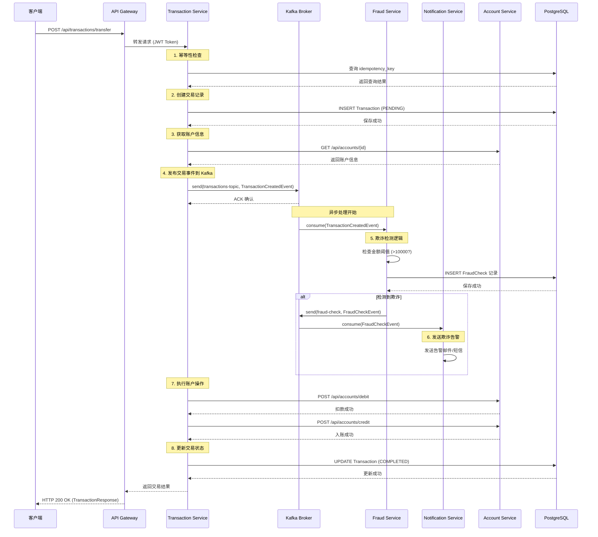

# Kafka 在 FinPay 项目中的实践指南

## 目录
- [概述](#概述)
- [架构设计](#架构设计)
- [Kafka 配置](#kafka-配置)
- [消息流时序图](#消息流时序图)
- [核心代码详解](#核心代码详解)
- [实战场景](#实战场景)
- [最佳实践](#最佳实践)

---

## 概述

FinPay 项目使用 Apache Kafka 作为事件驱动架构的核心消息中间件，实现微服务之间的异步通信和解耦。主要应用场景包括：

- **交易事件发布**：Transaction Service 发布交易创建事件
- **欺诈检测**：Fraud Service 消费交易事件进行风控检测
- **通知服务**：Notification Service 监听欺诈检测结果并发送告警

### 核心优势

1. **异步解耦**：服务间通过事件通信，降低耦合度
2. **高可靠性**：Kafka 持久化机制确保消息不丢失
3. **可扩展性**：通过分区实现水平扩展
4. **事件溯源**：所有交易事件可追溯和回放

---

## 架构设计

### 系统架构图

```
┌─────────────────────┐
│  API Gateway        │
│   (Port 8080)       │
└──────────┬──────────┘
           │
           ▼
┌─────────────────────┐       ┌──────────────────────┐
│ Transaction Service │──────▶│  Kafka Broker        │
│   (Port 8083)       │       │  (localhost:9092)    │
│                     │       │                      │
│ - TransactionProducer│      │  Topics:             │
│ - KafkaTemplate     │       │  • transactions-topic│
└─────────────────────┘       │  • fraud-check       │
                              └──────────┬───────────┘
                                         │
                    ┌────────────────────┼────────────────────┐
                    ▼                    ▼                    ▼
         ┌──────────────────┐  ┌──────────────────┐  ┌──────────────────┐
         │  Fraud Service   │  │ Notification Svc │  │   Analytics      │
         │  (Port 8085)     │  │  (Port 8084)     │  │   (Future)       │
         │                  │  │                  │  │                  │
         │ - FraudConsumer  │  │ - FraudNotif...  │  │ - Metrics        │
         │ - @KafkaListener │  │ - @KafkaListener │  │ - Dashboards     │
         └──────────────────┘  └──────────────────┘  └──────────────────┘
```

### Kafka Topic 设计

| Topic Name          | Producer Service    | Consumer Services      | 消息格式                | 用途                     |
|---------------------|---------------------|------------------------|-------------------------|--------------------------|
| `transactions-topic`| Transaction Service | Fraud Service          | TransactionCreatedEvent | 交易创建事件             |
| `fraud-check`       | Fraud Service       | Notification Service   | FraudCheckEvent         | 欺诈检测结果             |

---

## Kafka 配置

### Maven 依赖配置

#### Transaction Service (Producer)
```xml
<!-- transaction-service/pom.xml -->
<dependency>
    <groupId>org.springframework.kafka</groupId>
    <artifactId>spring-kafka</artifactId>
</dependency>
```

#### Fraud Service & Notification Service (Consumers)
```xml
<!-- fraud-service/pom.xml & notification-service/pom.xml -->
<dependency>
    <groupId>org.springframework.kafka</groupId>
    <artifactId>spring-kafka</artifactId>
</dependency>
```

### Application 配置

#### Transaction Service (Producer 配置)
```yaml
# transaction-service/src/main/resources/application.yml
spring:
  kafka:
    bootstrap-servers: localhost:9092
    producer:
      key-serializer: org.apache.kafka.common.serialization.StringSerializer
      value-serializer: org.springframework.kafka.support.serializer.JsonSerializer
```

**关键配置说明**：
- `bootstrap-servers`: Kafka 集群地址
- `key-serializer`: Key 序列化器（使用 String 类型）
- `value-serializer`: Value 序列化器（使用 JSON 格式）

#### Fraud Service (Consumer 配置)
```yaml
# fraud-service/src/main/resources/application.yml
spring:
  kafka:
    bootstrap-servers: localhost:9092
    consumer:
      group-id: fraud-service-group
      key-deserializer: org.apache.kafka.common.serialization.StringDeserializer
      value-deserializer: org.springframework.kafka.support.serializer.JsonDeserializer
      properties:
        spring.json.trusted.packages: com.finpay.common.dto.transactions
```

**关键配置说明**：
- `group-id`: 消费者组 ID，同一组内的消费者共享分区
- `key-deserializer`: Key 反序列化器
- `value-deserializer`: Value 反序列化器
- `spring.json.trusted.packages`: 信任的 JSON 反序列化包路径（安全配置）

#### Notification Service (Consumer 配置)
```yaml
# notification-service/src/main/resources/application.yml
spring:
  kafka:
    bootstrap-servers: localhost:9092
    consumer:
      group-id: notification-service-group
      key-deserializer: org.apache.kafka.common.serialization.StringDeserializer
      value-deserializer: org.springframework.kafka.support.serializer.JsonDeserializer
      properties:
        spring.json.trusted.packages: com.finpay.common.dto.transactions
```

---

## 消息流时序图

### 完整交易处理流程



### 关键时序说明

1. **同步流程** (1-3, 7-8)：交易创建、账户操作、状态更新
2. **异步流程** (4-6)：Kafka 事件发布与消费
3. **并行处理**：欺诈检测与交易处理可以并发进行，不阻塞主流程

---

## 核心代码详解

### 1. Kafka Producer 配置类

**文件位置**：[transaction-service/src/main/java/com/finpay/transactions/configs/KafkaProducerConfig.java](transaction-service/src/main/java/com/finpay/transactions/configs/KafkaProducerConfig.java)

```java
@Configuration
public class KafkaProducerConfig {

    /**
     * 创建 Kafka Producer 工厂
     * 配置序列化器和 Kafka 服务器地址
     */
    @Bean
    public ProducerFactory<String, TransactionCreatedEvent> producerFactory() {
        Map<String, Object> config = new HashMap<>();

        // Kafka 服务器地址
        config.put(ProducerConfig.BOOTSTRAP_SERVERS_CONFIG, "localhost:9092");

        // Key 序列化器：将交易 ID (String) 序列化
        config.put(ProducerConfig.KEY_SERIALIZER_CLASS_CONFIG, StringSerializer.class);

        // Value 序列化器：将事件对象序列化为 JSON
        config.put(ProducerConfig.VALUE_SERIALIZER_CLASS_CONFIG, JsonSerializer.class);

        return new DefaultKafkaProducerFactory<>(config);
    }

    /**
     * 创建 KafkaTemplate Bean
     * Spring 管理的 Kafka 发送模板，简化消息发送操作
     */
    @Bean
    public KafkaTemplate<String, TransactionCreatedEvent> kafkaTemplate() {
        return new KafkaTemplate<>(producerFactory());
    }
}
```

**代码关键点**：
- `ProducerFactory`: 负责创建 Kafka Producer 实例
- `BOOTSTRAP_SERVERS_CONFIG`: Kafka 集群地址配置
- `StringSerializer`: Key 使用字符串序列化，便于分区路由
- `JsonSerializer`: Value 使用 JSON 序列化，支持对象传输
- `KafkaTemplate`: Spring 封装的高级 API，提供同步/异步发送方法

### 2. Transaction Producer（事件发布者）

**文件位置**：[transaction-service/src/main/java/com/finpay/transactions/producers/TransactionProducer.java](transaction-service/src/main/java/com/finpay/transactions/producers/TransactionProducer.java)

```java
@Service
public class TransactionProducer {

    private final KafkaTemplate<String, TransactionCreatedEvent> kafkaTemplate;

    public TransactionProducer(KafkaTemplate<String, TransactionCreatedEvent> kafkaTemplate) {
        this.kafkaTemplate = kafkaTemplate;
    }

    /**
     * 发送交易创建事件到 Kafka
     *
     * @param event 交易事件对象
     *
     * 关键设计：
     * 1. Topic: "transactions-topic" - 固定的主题名称
     * 2. Key: event.getId().toString() - 使用交易 ID 作为 Key
     *    - 保证同一交易的所有事件发送到同一分区
     *    - 维护消息顺序性
     * 3. Value: event - 完整的事件对象（JSON 序列化）
     */
    public void sendTransaction(TransactionCreatedEvent event) {
        kafkaTemplate.send(
            "transactions-topic",           // Topic 名称
            event.getId().toString(),        // Message Key
            event                            // Message Value
        );
    }
}
```

**代码关键点**：
- **Fire-and-Forget 模式**：默认异步发送，不等待 Broker 确认
- **分区策略**：使用交易 ID 作为 Key，确保同一交易的消息有序
- **生产实践建议**：
  - 添加回调处理发送失败场景
  - 配置重试机制
  - 监控发送成功率

**使用示例** (来自 [TransactionService.java:197](transaction-service/src/main/java/com/finpay/transactions/services/TransactionService.java#L197))：
```java
// 在交易处理流程中发布事件
transactionProducer.sendTransaction(new TransactionCreatedEvent(
    tx.getId(),              // 交易 ID
    tx.getAmount(),          // 交易金额
    accDto.getOwnerEmail()   // 用户邮箱
));
```

### 3. TransactionCreatedEvent（事件 DTO）

**文件位置**：[common/src/main/java/com/finpay/common/dto/transactions/TransactionCreatedEvent.java](common/src/main/java/com/finpay/common/dto/transactions/TransactionCreatedEvent.java)

```java
@Data
@AllArgsConstructor
@NoArgsConstructor
public class TransactionCreatedEvent {
    /** 唯一交易标识符 */
    private UUID id;

    /** 交易金额 */
    private BigDecimal amount;

    /** 发起交易的用户 ID */
    private String userId;
}
```

**设计要点**：
- 使用 Lombok 注解减少样板代码
- 必须提供无参构造器（JSON 反序列化需要）
- 所有字段可序列化（UUID、BigDecimal、String）

### 4. Fraud Consumer（欺诈检测消费者）

**文件位置**：[fraud-service/src/main/java/com/finpay/frauds/services/FraudConsumer.java](fraud-service/src/main/java/com/finpay/frauds/services/FraudConsumer.java)

```java
@Service
public class FraudConsumer {

    private static final Logger log = LoggerFactory.getLogger(FraudConsumer.class);
    private final FraudService fraudService;

    public FraudConsumer(FraudService fraudService) {
        this.fraudService = fraudService;
    }

    /**
     * 消费交易事件并执行欺诈检测
     *
     * @KafkaListener 注解详解：
     * - topics: 监听的 Kafka 主题列表
     * - groupId: 消费者组 ID
     *   - 同一组内的多个实例负载均衡消费消息
     *   - 不同组可以独立消费全量消息
     */
    @KafkaListener(
        topics = "transactions-topic",       // 监听主题
        groupId = "fraud-service-group"      // 消费者组
    )
    public void consume(TransactionCreatedEvent event) {
        log.info("Received transaction from Kafka | id={} | amount={} | user={}",
                event.getId(), event.getAmount(), event.getUserId());

        // 简单的欺诈检测规则：金额超过 1000 标记为可疑
        boolean fraudulent = event.getAmount().compareTo(BigDecimal.valueOf(1000)) > 0;

        FraudCheckEvent fraudEvent = new FraudCheckEvent(event.getId(), fraudulent);

        // 执行完整的欺诈检测逻辑并保存结果
        fraudService.checkFraud(fraudEvent.getTransactionId(), event.getAmount());
    }
}
```

**代码关键点**：
- **@KafkaListener**: Spring Kafka 提供的监听器注解
- **自动反序列化**: Spring 自动将 JSON 消息反序列化为 `TransactionCreatedEvent`
- **消费者组**: `fraud-service-group` 实现负载均衡
- **业务逻辑**:
  - 初步检测：金额 > 1000 触发告警
  - 详细检测：调用 `fraudService.checkFraud()` 执行复杂规则

### 5. FraudService（欺诈检测服务）

**文件位置**：[fraud-service/src/main/java/com/finpay/frauds/services/FraudService.java](fraud-service/src/main/java/com/finpay/frauds/services/FraudService.java#L39-L57)

```java
@Service
public class FraudService {

    private final FraudCheckRepository repository;

    /**
     * 执行欺诈检测并保存结果
     *
     * 业务规则：
     * - 金额 > 10,000: 判定为欺诈
     * - 金额 <= 10,000: 判定为正常
     */
    public FraudCheckResponse checkFraud(UUID transactionId, BigDecimal amount) {
        // 应用欺诈检测规则
        boolean fraudulent = amount.compareTo(BigDecimal.valueOf(10000)) > 0;
        String reason = fraudulent ? "Amount exceeds fraud threshold" : "Transaction is valid";

        // 保存检测结果到数据库
        FraudCheck check = new FraudCheck();
        check.setTransactionId(transactionId);
        check.setFraudulent(fraudulent);
        check.setReason(reason);
        repository.save(check);

        return FraudCheckResponse.builder()
                .transactionId(transactionId)
                .fraudulent(fraudulent)
                .reason(reason)
                .build();
    }
}
```

**业务逻辑**：
1. 检测交易金额是否超过阈值（10,000）
2. 生成检测结果和原因说明
3. 持久化检测记录到 PostgreSQL
4. 返回检测响应

### 6. FraudCheckEvent（欺诈检测事件）

**文件位置**：[common/src/main/java/com/finpay/common/dto/frauds/FraudCheckEvent.java](common/src/main/java/com/finpay/common/dto/frauds/FraudCheckEvent.java)

```java
@Data
@AllArgsConstructor
@NoArgsConstructor
public class FraudCheckEvent {
    /** 被检测的交易 ID */
    private UUID transactionId;

    /** 是否判定为欺诈 */
    private boolean fraudulent;
}
```

### 7. Notification Consumer（通知消费者）

**文件位置**：[notification-service/src/main/java/com/finpay/notifications/services/FraudNotificationConsumer.java](notification-service/src/main/java/com/finpay/notifications/services/FraudNotificationConsumer.java)

```java
@Service
public class FraudNotificationConsumer {

    /**
     * 监听欺诈检测结果，发送告警通知
     *
     * 消费逻辑：
     * - 只处理欺诈标记为 true 的事件
     * - 发送告警通知（邮件/短信/推送）
     */
    @KafkaListener(
        topics = "fraud-check",                  // 监听欺诈检测主题
        groupId = "notification-service-group"   // 独立的消费者组
    )
    public void consume(FraudCheckEvent event) {
        if (event.isFraudulent()) {
            // 发送欺诈告警通知
            System.out.println("🚨 Send fraud alert for tx: " + event.getTransactionId());

            // TODO: 实际项目中应该：
            // 1. 调用邮件服务发送告警邮件
            // 2. 发送短信告警
            // 3. 推送到监控系统
            // 4. 记录告警日志
        }
    }
}
```

**设计模式**：
- **Event-Driven**: 完全解耦的事件驱动架构
- **关注点分离**: 通知服务只关心通知逻辑
- **可扩展性**: 可以轻松添加更多消费者（如 Analytics Service）

---

## 实战场景

### 场景 1：创建交易并触发欺诈检测

#### 步骤 1：客户端发起交易请求
```bash
curl -X POST http://localhost:8080/api/transactions/transfer \
  -H "Authorization: Bearer <JWT_TOKEN>" \
  -H "Content-Type: application/json" \
  -H "Idempotency-Key: unique-key-12345" \
  -d '{
    "fromAccountId": "a1b2c3d4-e5f6-7890-abcd-ef1234567890",
    "toAccountId": "b2c3d4e5-f678-90ab-cdef-123456789012",
    "amount": 15000.00
  }'
```

#### 步骤 2：Transaction Service 处理流程

**代码执行路径**：[TransactionService.java:116-152](transaction-service/src/main/java/com/finpay/transactions/services/TransactionService.java#L116-L152)

```java
// 1. 幂等性检查
Optional<Transaction> existing = repository.findByIdempotencyKey("unique-key-12345");

// 2. 创建新交易
Transaction newTx = new Transaction();
newTx.setAmount(BigDecimal.valueOf(15000));
newTx.setStatus(PENDING);
repository.save(newTx);

// 3. 发布 Kafka 事件
transactionProducer.sendTransaction(new TransactionCreatedEvent(
    newTx.getId(),
    newTx.getAmount(),
    "user@example.com"
));
```

#### 步骤 3：Kafka 消息流转

**消息内容**：
```json
{
  "id": "c3d4e5f6-7890-abcd-ef12-34567890abcd",
  "amount": 15000.00,
  "userId": "user@example.com"
}
```

**Kafka Topic**: `transactions-topic`
**Partition Key**: `c3d4e5f6-7890-abcd-ef12-34567890abcd`

#### 步骤 4：Fraud Service 消费并检测

**代码执行路径**：[FraudConsumer.java:38-48](fraud-service/src/main/java/com/finpay/frauds/services/FraudConsumer.java#L38-L48)

```java
// 消费消息
@KafkaListener(topics = "transactions-topic", groupId = "fraud-service-group")
public void consume(TransactionCreatedEvent event) {
    // amount = 15000 > 10000 => fraudulent = true
    fraudService.checkFraud(event.getId(), event.getAmount());
}
```

**数据库记录**：
```sql
INSERT INTO fraud_checks (transaction_id, fraudulent, reason)
VALUES ('c3d4e5f6-7890-abcd-ef12-34567890abcd', true, 'Amount exceeds fraud threshold');
```

#### 步骤 5：Notification Service 发送告警

**代码执行路径**：[FraudNotificationConsumer.java:21-26](notification-service/src/main/java/com/finpay/notifications/services/FraudNotificationConsumer.java#L21-L26)

```java
@KafkaListener(topics = "fraud-check", groupId = "notification-service-group")
public void consume(FraudCheckEvent event) {
    if (event.isFraudulent()) {
        // 发送告警邮件
        System.out.println("🚨 Send fraud alert for tx: " + event.getTransactionId());
    }
}
```

### 场景 2：幂等性保证

**问题**：网络抖动导致客户端重试相同请求

**解决方案**：使用 `Idempotency-Key` 实现幂等性

```bash
# 第一次请求
curl -H "Idempotency-Key: retry-key-001" ...

# 网络超时，客户端重试
curl -H "Idempotency-Key: retry-key-001" ...  # 相同的 Key
```

**代码逻辑**：[TransactionService.java:121-138](transaction-service/src/main/java/com/finpay/transactions/services/TransactionService.java#L121-L138)

```java
Optional<Transaction> existing = repository.findByIdempotencyKey("retry-key-001");

if (existing.isPresent()) {
    Transaction tx = existing.get();
    return switch (tx.getStatus()) {
        case COMPLETED, PENDING -> toResponse(tx);  // 直接返回，不重复处理
        case FAILED -> retryPayment(tx, request);   // 失败交易允许重试
    };
}
```

**关键点**：
- 相同 `Idempotency-Key` 的请求只会创建一次交易
- Kafka 事件也只会发布一次
- 避免重复扣款和重复通知

---

## 最佳实践

### 1. 消息序列化与反序列化

#### Producer 端
```java
// 使用 JsonSerializer 自动序列化对象
config.put(ProducerConfig.VALUE_SERIALIZER_CLASS_CONFIG, JsonSerializer.class);
```

#### Consumer 端
```yaml
spring:
  kafka:
    consumer:
      value-deserializer: org.springframework.kafka.support.serializer.JsonDeserializer
      properties:
        # 关键：指定信任的反序列化包，防止安全漏洞
        spring.json.trusted.packages: com.finpay.common.dto.transactions
```

**安全说明**：
- `trusted.packages` 防止反序列化攻击
- 只允许指定包下的类被反序列化
- 生产环境必须配置此项

### 2. 消费者组设计

```yaml
# fraud-service
group-id: fraud-service-group

# notification-service
group-id: notification-service-group
```

**原则**：
- 不同业务服务使用不同 `group-id`
- 同一服务的多个实例使用相同 `group-id`（负载均衡）
- 独立消费者组可以独立消费所有消息

### 3. 分区 Key 策略

```java
// 使用交易 ID 作为 Key
kafkaTemplate.send("transactions-topic", event.getId().toString(), event);
```

**优势**：
- 同一交易的所有事件发送到同一分区
- 保证消息顺序性
- 便于排查问题（相关消息在同一分区）

### 4. 错误处理

#### Producer 端添加回调
```java
public void sendTransaction(TransactionCreatedEvent event) {
    kafkaTemplate.send("transactions-topic", event.getId().toString(), event)
        .addCallback(
            result -> log.info("Message sent successfully: {}", event.getId()),
            ex -> log.error("Failed to send message: {}", event.getId(), ex)
        );
}
```

#### Consumer 端错误处理
```java
@KafkaListener(topics = "transactions-topic", groupId = "fraud-service-group")
public void consume(TransactionCreatedEvent event) {
    try {
        fraudService.checkFraud(event.getId(), event.getAmount());
    } catch (Exception e) {
        log.error("Failed to process transaction: {}", event.getId(), e);
        // 1. 记录到死信队列
        // 2. 发送告警
        // 3. 存储失败记录供后续重试
    }
}
```

### 5. 监控指标

#### 关键指标
- **Producer 指标**：
  - 发送成功率
  - 发送延迟 (P99, P95)
  - 发送失败数

- **Consumer 指标**：
  - 消费延迟 (Lag)
  - 处理速率 (TPS)
  - 错误率

#### 监控方案
```yaml
# application.yml
management:
  endpoints:
    web:
      exposure:
        include: prometheus,health,info
  endpoint:
    prometheus:
      enabled: true
```

**工具链**：
- Prometheus：指标采集
- Grafana：可视化监控
- Kafka Exporter：Kafka 集群监控

### 6. 生产环境优化

#### Producer 配置优化
```yaml
spring:
  kafka:
    producer:
      acks: all                    # 确保消息不丢失
      retries: 3                   # 自动重试次数
      batch-size: 16384            # 批量发送大小
      linger-ms: 10                # 批量发送延迟
      compression-type: snappy     # 压缩算法
```

#### Consumer 配置优化
```yaml
spring:
  kafka:
    consumer:
      enable-auto-commit: false    # 手动提交 offset
      max-poll-records: 500        # 单次拉取最大消息数
      session-timeout-ms: 30000    # 会话超时时间
```

### 7. 事务性保证

#### 场景：同时更新数据库和发送 Kafka 消息
```java
@Transactional
public TransactionResponse processAndSave(Transaction tx, TransferRequest request) {
    // 1. 数据库操作
    repository.save(tx);

    // 2. Kafka 发送（如果失败，数据库操作也会回滚）
    transactionProducer.sendTransaction(new TransactionCreatedEvent(...));

    // 使用 Kafka 事务确保原子性
}
```

**注意**：
- Spring `@Transactional` 只保证数据库事务
- Kafka 事务需要单独配置 `transactional-id`
- 考虑使用 Outbox Pattern 实现最终一致性

---

## 总结

### 核心要点回顾

1. **架构设计**
   - 使用 Kafka 实现事件驱动架构
   - 微服务通过事件解耦，提升系统可维护性

2. **配置管理**
   - Producer 配置序列化器和 Broker 地址
   - Consumer 配置消费者组和反序列化器
   - 使用 `trusted.packages` 确保安全性

3. **代码实现**
   - `KafkaProducerConfig`: 配置 Producer Factory 和 KafkaTemplate
   - `TransactionProducer`: 发布交易事件
   - `FraudConsumer`: 消费交易事件并检测欺诈
   - `FraudNotificationConsumer`: 监听欺诈结果并发送告警

4. **最佳实践**
   - 使用 JSON 序列化传输对象
   - 合理设计消费者组
   - 使用分区 Key 保证消息顺序
   - 实现完善的错误处理和监控
   - 生产环境优化配置参数

### 扩展阅读

- [Spring Kafka 官方文档](https://docs.spring.io/spring-kafka/reference/)
- [Apache Kafka 文档](https://kafka.apache.org/documentation/)
- [Kafka 消费者组详解](https://kafka.apache.org/documentation/#consumerconfigs)
- [事件驱动架构最佳实践](https://martinfowler.com/articles/201701-event-driven.html)

---

**文档版本**: v1.0
**最后更新**: 2025-01-25
**作者**: FinPay Team
