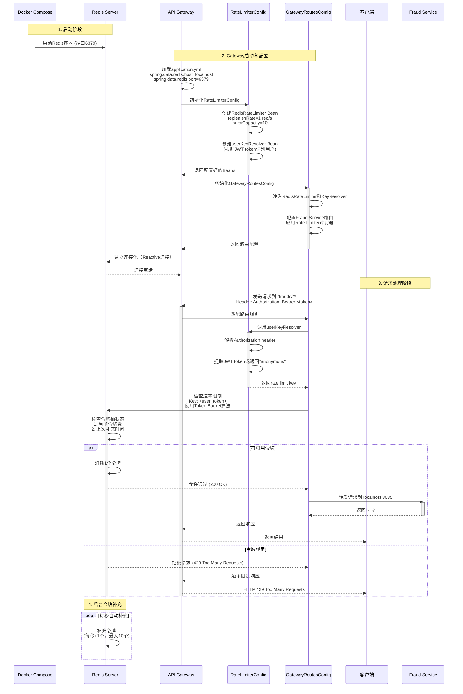

# Redis配置与调用流程详解

## 概述

本文档详细介绍了Redis在FinPay项目中的配置和调用顺序，包括时序图、配置说明和工作原理。

---

## 时序图



---

## 1. Redis配置层次

### 1.1 Docker层配置

**文件**: `docker-compose.yml`

```yaml
redis:
    image: redis:7
    ports:
        - "6379:6379"
```

**说明**:
- 使用Redis 7版本
- 映射端口6379到主机
- 无持久化配置（开发环境）

---

### 1.2 Spring配置层

**文件**: `api-gateway/src/main/resources/application.yml`

```yaml
spring:
  data:
    redis:
      host: localhost
      port: 6379
```

**说明**:
- 配置Gateway连接到本地Redis实例
- 使用默认配置（无密码、无SSL）

---

### 1.3 Maven依赖

**文件**: `api-gateway/pom.xml`

```xml
<!-- Redis Rate Limiter -->
<dependency>
    <groupId>org.springframework.boot</groupId>
    <artifactId>spring-boot-starter-data-redis-reactive</artifactId>
</dependency>
```

**特点**:
- 使用Spring Boot Reactive Redis依赖
- 支持非阻塞、响应式编程模型
- 适合高并发场景

---

## 2. Redis Rate Limiter配置

### 2.1 RateLimiterConfig类

**文件**: [api-gateway/src/main/java/com/finpay/gateway/config/RateLimiterConfig.java](../api-gateway/src/main/java/com/finpay/gateway/config/RateLimiterConfig.java)

#### RedisRateLimiter Bean

```java
@Bean
public RedisRateLimiter redisRateLimiter() {
    // Allow 1 request per second with burst capacity of 10
    return new RedisRateLimiter(1, 10);
}
```

**参数说明**:
| 参数 | 值 | 说明 |
|------|-----|------|
| replenishRate | 1 | 每秒补充1个令牌 |
| burstCapacity | 10 | 令牌桶最大容量10个 |

**算法**: Token Bucket (令牌桶算法)

---

#### UserKeyResolver Bean

```java
@Bean
public KeyResolver userKeyResolver() {
    return exchange -> {
        String authHeader = exchange.getRequest()
            .getHeaders().getFirst("Authorization");
        if (authHeader != null && authHeader.startsWith("Bearer ")) {
            // Use JWT token as the rate limiting key for authenticated users
            return Mono.just(authHeader.substring(7));
        }
        // All anonymous requests share the same rate limit
        return Mono.just("anonymous");
    };
}
```

**功能说明**:
- **作用**: 从HTTP请求中提取限流Key
- **认证用户**: 使用JWT token作为唯一标识（每个用户独立限流）
- **匿名用户**: 共享"anonymous"这个Key（所有匿名用户共享限流配额）

---

## 3. 路由配置与Rate Limiter应用

### 3.1 GatewayRoutesConfig类

**文件**: [api-gateway/src/main/java/com/finpay/gateway/config/GatewayRoutesConfig.java](../api-gateway/src/main/java/com/finpay/gateway/config/GatewayRoutesConfig.java)

```java
@Configuration
public class GatewayRoutesConfig {
    private final RedisRateLimiter redisRateLimiter;
    private final KeyResolver userKeyResolver;

    public GatewayRoutesConfig(RedisRateLimiter redisRateLimiter,
                               KeyResolver userKeyResolver) {
        this.redisRateLimiter = redisRateLimiter;
        this.userKeyResolver = userKeyResolver;
    }

    @Bean
    public RouteLocator customRotes(RouteLocatorBuilder builder) {
        return builder.routes()
            // Fraud Service routes - fraud detection with rate limiting
            .route("fraud-service", r -> r.path("/frauds/**")
                .filters(f -> f
                    .requestRateLimiter(c -> {
                        c.setRateLimiter(redisRateLimiter);
                        c.setKeyResolver(userKeyResolver);
                    })
                )
                .uri("http://localhost:8085")
            )
            // ... other routes without rate limiting
            .build();
    }
}
```

**重要说明**:
- **只有Fraud Service路由应用了Rate Limiter**
- 其他服务（Auth, Account, Transaction, Notification）没有限流

**为什么只限流Fraud Service?**
1. Fraud检测是计算密集型操作
2. 防止恶意用户频繁调用
3. 保护后端服务资源
4. 减少滥用风险

---

## 4. 工作原理详解

### 4.1 Token Bucket算法流程

#### 阶段1: 初始化
1. Gateway启动时加载application.yml配置
2. Spring自动创建ReactiveRedisTemplate
3. 创建RedisRateLimiter和userKeyResolver Beans
4. GatewayRoutesConfig注入这些Beans
5. 建立与Redis的连接池

#### 阶段2: 请求到达
```
用户请求: GET /frauds/check/123
Header: Authorization: Bearer eyJhbGc...
```

#### 阶段3: Key解析
```java
// userKeyResolver执行
String authHeader = "Bearer eyJhbGc..."
String key = authHeader.substring(7)
// 结果: key = "eyJhbGc..."
```

#### 阶段4: Redis检查（原子操作）

Spring Gateway使用Lua脚本保证原子性:

```lua
-- 伪代码示例
local tokens_key = "request_rate_limiter." .. key .. ".tokens"
local timestamp_key = "request_rate_limiter." .. key .. ".timestamp"

local rate = 1  -- replenishRate
local capacity = 10  -- burstCapacity
local now = redis.call('TIME')

-- 获取当前状态
local last_tokens = redis.call('GET', tokens_key) or capacity
local last_refreshed = redis.call('GET', timestamp_key) or 0

-- 计算应补充的令牌
local delta = math.max(0, now - last_refreshed)
local filled_tokens = math.min(capacity, last_tokens + (delta * rate))

-- 检查是否有可用令牌
if filled_tokens >= 1 then
    -- 消耗1个令牌
    redis.call('SET', tokens_key, filled_tokens - 1)
    redis.call('SET', timestamp_key, now)
    return {1, filled_tokens - 1}  -- 允许请求
else
    return {0, filled_tokens}  -- 拒绝请求
end
```

#### 阶段5: 响应处理

**允许请求 (200 OK)**:
```
X-RateLimit-Remaining: 9
X-RateLimit-Burst-Capacity: 10
X-RateLimit-Replenish-Rate: 1
```
→ 转发到 Fraud Service (localhost:8085)

**拒绝请求 (429 Too Many Requests)**:
```json
{
  "error": "Too Many Requests",
  "message": "Rate limit exceeded. Try again in 1 second."
}
```

---

### 4.2 Redis数据结构

实际存储在Redis中的数据:

```
Key: request_rate_limiter.{user_token}.tokens
Type: String
Value: "9"  (当前令牌数, 0-10)
TTL: 自动设置

Key: request_rate_limiter.{user_token}.timestamp
Type: String
Value: "1698765432"  (Unix时间戳)
TTL: 自动设置
```

**示例**:
```bash
# Redis CLI查看
redis-cli
> GET request_rate_limiter.eyJhbGc.tokens
"9"
> GET request_rate_limiter.eyJhbGc.timestamp
"1698765432"
```

---

## 5. 优势与特性

### 5.1 技术优势

| 特性 | 说明 |
|------|------|
| **高性能** | Reactive非阻塞模型，适合高并发场景 |
| **分布式** | 多个Gateway实例共享Redis，限流统一 |
| **精确控制** | 令牌桶算法支持突发流量（最多10个请求） |
| **用户隔离** | 不同用户独立限流，互不影响 |
| **自动清理** | Redis可配置TTL自动清理过期Key |
| **原子操作** | Lua脚本保证检查和扣减的原子性 |

### 5.2 业务优势

- **防止API滥用**: 限制单个用户请求频率
- **资源保护**: 避免Fraud Service过载
- **公平性**: 每个用户享有相同的配额
- **弹性**: 支持短时间内的突发请求（burst capacity）

---

## 6. 测试场景示例

### 6.1 场景1: 正常请求

```bash
curl -H "Authorization: Bearer token123" \
     http://localhost:8080/frauds/check/1

# 响应
HTTP/1.1 200 OK
X-RateLimit-Remaining: 9
X-RateLimit-Burst-Capacity: 10
X-RateLimit-Replenish-Rate: 1
```

**令牌状态**: 10 → 9

---

### 6.2 场景2: 快速连续请求（11次）

```bash
# 发送11次连续请求
for i in {1..11}; do
  echo "Request $i:"
  curl -H "Authorization: Bearer token123" \
       http://localhost:8080/frauds/check/$i
  echo ""
done

# 结果
Request 1-10: 200 OK
Request 11: 429 Too Many Requests
```

**令牌状态**: 10 → 9 → 8 → ... → 0 → **拒绝**

---

### 6.3 场景3: 等待后恢复

```bash
# 等待1秒
sleep 1

# 再次请求
curl -H "Authorization: Bearer token123" \
     http://localhost:8080/frauds/check/1

# 响应
HTTP/1.1 200 OK
X-RateLimit-Remaining: 0
```

**令牌状态**: 0 → (补充1个) → 1 → 0

---

### 6.4 场景4: 多用户隔离

```bash
# 用户A耗尽配额
for i in {1..10}; do
  curl -H "Authorization: Bearer tokenA" \
       http://localhost:8080/frauds/check/$i
done

# 用户A被限流
curl -H "Authorization: Bearer tokenA" \
     http://localhost:8080/frauds/check/11
# → 429 Too Many Requests

# 用户B仍可正常访问
curl -H "Authorization: Bearer tokenB" \
     http://localhost:8080/frauds/check/1
# → 200 OK
```

---

## 7. 配置调优建议

### 7.1 生产环境配置

```java
@Bean
public RedisRateLimiter redisRateLimiter() {
    // 根据实际需求调整
    int replenishRate = 10;  // 每秒10个请求
    int burstCapacity = 20;  // 允许短时间20个请求
    return new RedisRateLimiter(replenishRate, burstCapacity);
}
```

### 7.2 Redis连接池配置

```yaml
spring:
  data:
    redis:
      host: localhost
      port: 6379
      password: ${REDIS_PASSWORD}  # 生产环境应设置密码
      lettuce:
        pool:
          max-active: 8
          max-idle: 8
          min-idle: 0
          max-wait: -1ms
```

### 7.3 不同服务的限流策略

| 服务 | 建议配置 | 原因 |
|------|---------|------|
| Fraud Service | 1-10 req/s | 计算密集，需严格限制 |
| Transaction Service | 10-50 req/s | 核心业务，适中限制 |
| Account Service | 50-100 req/s | 查询为主，宽松限制 |
| Auth Service | 5-20 req/s | 安全敏感，严格限制 |

---

## 8. 监控与告警

### 8.1 监控指标

```java
// 可添加Micrometer指标
@Bean
public RedisRateLimiter redisRateLimiter(MeterRegistry registry) {
    RedisRateLimiter limiter = new RedisRateLimiter(1, 10);

    // 记录限流事件
    registry.counter("rate_limiter.requests.denied");
    registry.counter("rate_limiter.requests.allowed");

    return limiter;
}
```

### 8.2 日志记录

```yaml
logging:
  level:
    org.springframework.cloud.gateway.filter.ratelimit: DEBUG
    org.springframework.data.redis: DEBUG
```

---

## 9. 故障处理

### 9.1 Redis不可用时的降级策略

当前实现: **如果Redis不可用，所有请求会被拒绝**

**改进方案**:

```java
@Bean
public RedisRateLimiter redisRateLimiter() {
    RedisRateLimiter limiter = new RedisRateLimiter(1, 10);

    // 设置降级策略
    limiter.setDenyEmptyKey(false);  // Redis异常时放行请求

    return limiter;
}
```

### 9.2 常见问题排查

| 问题 | 原因 | 解决方案 |
|------|------|---------|
| 所有请求返回429 | Redis连接失败 | 检查Redis服务状态 |
| 限流不生效 | KeyResolver返回null | 检查JWT解析逻辑 |
| 性能下降 | Redis延迟高 | 优化Redis配置或增加实例 |

---

## 10. 总结

### 核心流程回顾

1. **Docker启动Redis** (端口6379)
2. **Gateway加载配置** (application.yml)
3. **创建Bean** (RedisRateLimiter + KeyResolver)
4. **路由配置** (只在Fraud Service应用)
5. **请求处理** (解析Key → 检查Redis → 放行/拒绝)
6. **令牌补充** (每秒自动补充)

### 关键代码位置

- Redis配置: [api-gateway/src/main/resources/application.yml:24-27](../api-gateway/src/main/resources/application.yml#L24-L27)
- Rate Limiter配置: [api-gateway/src/main/java/com/finpay/gateway/config/RateLimiterConfig.java](../api-gateway/src/main/java/com/finpay/gateway/config/RateLimiterConfig.java)
- 路由配置: [api-gateway/src/main/java/com/finpay/gateway/config/GatewayRoutesConfig.java:62-70](../api-gateway/src/main/java/com/finpay/gateway/config/GatewayRoutesConfig.java#L62-L70)
- Docker配置: [docker-compose.yml:23-26](../docker-compose.yml#L23-L26)

---

## 附录

### A. 相关技术文档

- [Spring Cloud Gateway - Rate Limiter](https://docs.spring.io/spring-cloud-gateway/docs/current/reference/html/#the-requestratelimiter-gatewayfilter-factory)
- [Redis Rate Limiting](https://redis.io/glossary/rate-limiting/)
- [Token Bucket Algorithm](https://en.wikipedia.org/wiki/Token_bucket)

### B. 项目架构文档

- [API Gateway Architecture](../api-gateway/GATEWAY-ARCHITECTURE.md)
- [FinPay Learning Guide](../LEARNING-GUIDE.md)
- [Testing Summary](../TESTING-SUMMARY.md)

---

**文档版本**: 1.0
**创建日期**: 2025-10-25
**作者**: FinPay Team
**最后更新**: 2025-10-25
